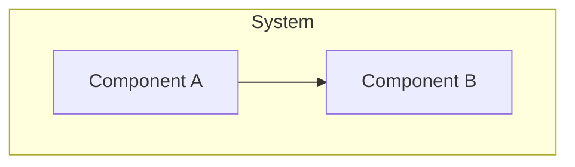

<!-- GENERATED HUMAN-READABLE ARCHITECTURE DOCUMENT.
     This file is a derived artifact regenerated by the update flow (/uan) after every
     architecture change. It is EXCLUDED from AI auto-load (not referenced by
     .architecture-notes.md) so it never pollutes agent context. Do not hand-edit the
     generated sections; edit the contracts/arch notes and regenerate.

     Freshness is tracked by the canonical content hash of the contract sources embedded in the
     marker below. Test-ArchDocFreshness recomputes it and flags drift. -->
<!-- arch-contracts-sha256: UNSEEDED -->

# <PROJECT_NAME> — Architecture Overview

> Human-readable companion to the AI-optimized `docs/architecture-notes/` tier. For larger
> projects this document can grow into a hierarchy (this overview → per-subsystem pages).

## Purpose & Scope

<!-- Narrative: what the system is, its top-level goals, and the boundaries it maintains. -->

<!-- Do not hand-edit the generated region below; edit the contracts and regenerate. -->
<!-- BEGIN GENERATED: contracts -->

## System Diagram

## Components

<!-- Per-component prose: responsibility, the contracts that govern it, and rationale for the
     boundary. Link to the governing contract ids and arch notes. -->

### <Component>

- **Responsibility:** <what it owns>
- **Governing contracts:** `<CONTRACT_ID>` (<maturity>)
- **Rationale:** <why this boundary exists>

<!-- END GENERATED: contracts -->

## Decision Records

<!-- Human-readable narrative of active ADRs, with links to the source records in the AI tier
     and any external resources. Superseded ADRs are summarized/archived, not deleted. -->

## Resources

<!-- Links: external docs, RFCs, diagrams, discussions. -->
