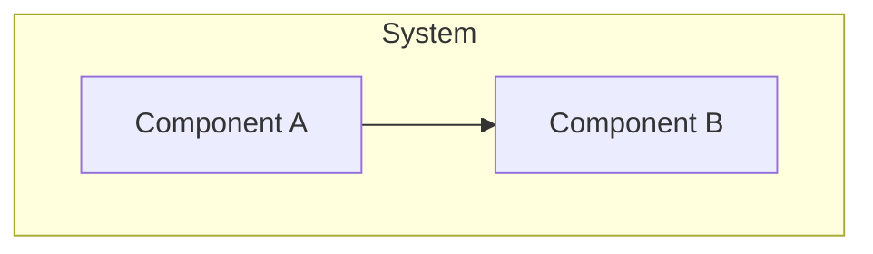

<!-- LEGACY JSON CONTRACT COMPATIBILITY VIEW.
     This derived artifact covers only transferred JSON contracts under schemas/architecture/.
     Markdown architecture notes are already human-readable and are not duplicated here. This
     file is excluded from AI auto-load. Do not hand-edit the generated sections.

     Freshness is tracked by the canonical content hash of the contract sources embedded in the
     marker below. Test-ArchDocFreshness recomputes it and flags drift. -->
<!-- arch-contracts-sha256: UNSEEDED -->

# <PROJECT_NAME> — Architecture Overview

> Temporary view of remaining legacy JSON contracts. Indexed Markdown notes are authoritative.

## Purpose & Scope

<!-- Narrative: what the system is, its top-level goals, and the boundaries it maintains. -->

<!-- Do not hand-edit the generated region below; edit a legacy JSON contract and regenerate. -->
<!-- BEGIN GENERATED: contracts -->

## System Diagram

## Components

<!-- Per-component prose: responsibility, the contracts that govern it, and rationale for the
     boundary. Link to the governing contract ids and arch notes. -->

### <Component>

- **Responsibility:** <what it owns>
- **Governing contracts:** `<CONTRACT_ID>` (<maturity>)
- **Rationale:** <why this boundary exists>

<!-- END GENERATED: contracts -->

## Decision Records

<!-- Human-readable narrative of active ADRs, with links to the source records in the AI tier
     and any external resources. Superseded ADRs are summarized/archived, not deleted. -->

## Resources

<!-- Links: external docs, RFCs, diagrams, discussions. -->
