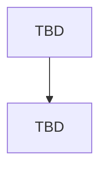

# Approved Design

<!--
Describe the agreed program shape, not implementation detail. Replace every TBD and confirm the result with
the operator before detailed plan drafting. A Mermaid program flow is required. Call stacks are optional.
-->

## Components and boundaries

- TBD

## Program flow

## Optional call stacks

Add call stacks only when they clarify important control flow; otherwise state that the Mermaid flow is sufficient.
