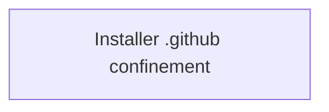

<!-- LEGACY JSON CONTRACT COMPATIBILITY VIEW.
     This derived artifact covers only the transferred JSON contracts that remain under
     schemas/architecture/. Markdown architecture notes are already human-readable and are not
     duplicated here. This file is excluded from AI auto-load.

     Freshness is tracked by the canonical content hash of the contract sources embedded in the
     marker below. Test-ArchDocFreshness recomputes it and flags drift. -->
<!-- arch-contracts-sha256: 0431576e711d062134ec9fd7f68f64398dc208adbf0c0d24ed857bc164198c50 -->

# Skalary — Architecture Overview

> Temporary view of the remaining legacy JSON contracts. The indexed Markdown notes are the
> authoritative human-readable architecture.

## Purpose & Scope

<!-- Narrative: what the system is, its top-level goals, and the boundaries it maintains. -->

<!-- Do not hand-edit the generated region below; edit a legacy JSON contract and regenerate. -->
<!-- BEGIN GENERATED: contracts -->

## System Diagram

## Components

### Installer .github confinement

- **Governing contract:** `ARCH-Install-Confinement` (provisional)
- **Boundary:** Security boundary: untrusted plugin metadata and recovery state can never cause mutation outside .github/ or through linked parents. Enforced by confinement, link rejection, the shared mutation lock, journal validation, and registry/install/remove tests.

<!-- END GENERATED: contracts -->

## Decision Records

<!-- Human-readable narrative of active ADRs, with links to the source records in the AI tier
     and any external resources. Superseded ADRs are summarized/archived, not deleted. -->

## Resources

<!-- Links: external docs, RFCs, diagrams, discussions. -->
