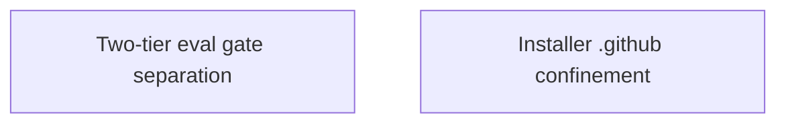

<!-- GENERATED HUMAN-READABLE ARCHITECTURE DOCUMENT.
     This file is a derived artifact regenerated by the update flow (/uan) after every
     architecture change. It is EXCLUDED from AI auto-load (not referenced by
     .architecture-notes.md) so it never pollutes agent context. Do not hand-edit the
     generated sections; edit the contracts/arch notes and regenerate.

     Freshness is tracked by the canonical content hash of the contract sources embedded in the
     marker below. Test-ArchDocFreshness recomputes it and flags drift. -->
<!-- arch-contracts-sha256: f429c5142c6fc749a1b7a7a92bf725e722b888132e665cdab59f7ac590ef6045 -->

# Skalary — Architecture Overview

> Human-readable companion to the AI-optimized `docs/architecture-notes/` tier. For larger
> projects this document can grow into a hierarchy (this overview → per-subsystem pages).

## Purpose & Scope

<!-- Narrative: what the system is, its top-level goals, and the boundaries it maintains. -->

<!-- Do not hand-edit the generated region below; edit the contracts and regenerate. -->
<!-- BEGIN GENERATED: contracts -->

## System Diagram

## Components

### Two-tier eval gate separation

- **Governing contract:** `ARCH-Eval-Gate-Separation` (provisional)
- **Boundary:** Keeps CI deterministic and offline: no premium-cost, auth-dependent, non-deterministic LLM call can enter the always-on gate. Enforced by Test-Evals.ps1 (Tier-1 only) vs Invoke-WazaEvals.ps1 (Tier-2 only).

### Installer .github confinement

- **Governing contract:** `ARCH-Install-Confinement` (provisional)
- **Boundary:** Security boundary: a plugin manifest (untrusted for this purpose) can never cause a write outside .github/. Enforced by Resolve-GithubConstrainedPath and Test-Registry; covered by install/remove tests.

<!-- END GENERATED: contracts -->

## Decision Records

<!-- Human-readable narrative of active ADRs, with links to the source records in the AI tier
     and any external resources. Superseded ADRs are summarized/archived, not deleted. -->

## Resources

<!-- Links: external docs, RFCs, diagrams, discussions. -->
