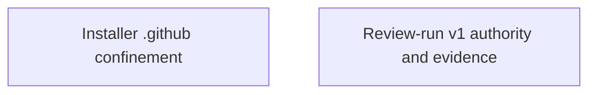

<!-- GENERATED HUMAN-READABLE ARCHITECTURE DOCUMENT.
     This file is a derived artifact regenerated by the update flow (/uan) after every
     architecture change. It is EXCLUDED from AI auto-load (not referenced by
     .architecture-notes.md) so it never pollutes agent context. Do not hand-edit the
     generated sections; edit the contracts/arch notes and regenerate.

     Freshness is tracked by the canonical content hash of the contract sources embedded in the
     marker below. Test-ArchDocFreshness recomputes it and flags drift. -->
<!-- arch-contracts-sha256: c22d12c67ecce4aaba38c40b09339c3b0d06cc7d9849516870b43fb30bc50a26 -->

# Skalary — Architecture Overview

> Human-readable companion to the AI-optimized `docs/architecture-notes/` tier. For larger
> projects this document can grow into a hierarchy (this overview → per-subsystem pages).

## Purpose & Scope

<!-- Narrative: what the system is, its top-level goals, and the boundaries it maintains. -->

<!-- Do not hand-edit the generated region below; edit the contracts and regenerate. -->
<!-- BEGIN GENERATED: contracts -->

## System Diagram

## Components

### Installer .github confinement

- **Governing contract:** `ARCH-Install-Confinement` (provisional)
- **Boundary:** Security boundary: untrusted plugin metadata and recovery state can never cause mutation outside .github/ or through linked parents. Enforced by confinement, link rejection, the shared mutation lock, journal validation, and registry/install/remove tests.

### Review-run v1 authority and evidence

- **Governing contract:** `ARCH-Review-Run-V1` (provisional)
- **Boundary:** Defines the interface-level boundary between frozen review scope, published execution authority, verified delivery, and compact durable plan evidence.

<!-- END GENERATED: contracts -->

## Decision Records

<!-- Human-readable narrative of active ADRs, with links to the source records in the AI tier
     and any external resources. Superseded ADRs are summarized/archived, not deleted. -->

## Resources

<!-- Links: external docs, RFCs, diagrams, discussions. -->
