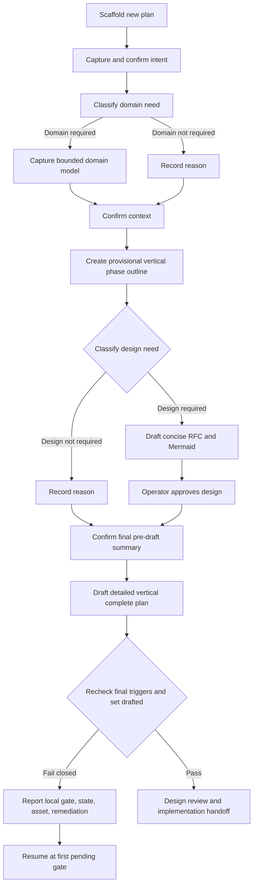

# Approved Design: Confirmed Planning Context

> Status: approved by the operator on 2026-08-21. This is an **as-designed** artifact. Planning decisions that change boundaries, states, triggers, or user-visible flow require an update and renewed approval.

## Problem and constraints

The current five-section intent asset preserves an outcome but does not durably prove intermediate understanding, distinguish domain knowledge from workflow notes, or expose program shape before implementation. The solution must remain concise, work in installed consumer repos, preserve legacy plans, use script-only mutation for machine state, and avoid new packages or telemetry.

## Components and boundaries

- `<!-- interview-gates: required -->` independently enrolls new plans; marker-less plans retain legacy behavior with an explicit skip signal.
- `schemas/plan/interview-gates.schema.json` owns the bundled JSON shape and enums; PowerShell 7.0-compatible code performs strict runtime validation and parity tests keep it aligned. `assets/interview-gates.json` carries bounded, versioned, current-value-only state.
- `PlanState.psm1` owns the closed marker/asset vocabulary, layout resolution, transitions, parsing, final-plan trigger comparison, and canonical reader used by scaffold, writer, lifecycle, validator, `/ci`, `/dr`, and autopilot.
- `Set-InterviewGates.ps1` is the canonical-plan-bound, confined, 5-second locked, idempotent, batched, read-back-verified writer for gate state and governed intent/domain/design content. It receives free text through bounded stdin envelopes, initializes `/cip` and `/cep`, invalidates before content writes, supports revocation, rejects archives, and performs explicit repair only after a supported-version check.
- `assets/intent.md`, conditional `assets/domain.md`, `assets/design.md`, and decision assets carry human meaning.
- `New-Plan.ps1` writes the independent marker, pending/unassessed state, and bounded templates.
- `Set-PlanStage.ps1` remains the only lifecycle writer and refuses `drafted` until enrolled gates pass; `Test-Plan.ps1` preserves integrity at all validation stages.
- `/cip` owns elicitation, provisional outline, classification, and interactive approval orchestration; `/ci`, `/dr`, and autopilot use the same installed reader for bounded inert context; `/pfb` remains anchored to intent.
- Generic dependency admission resolves direct and transitive `depends-on` tokens for `/ci` and autopilot before mutation; archived or complete dependencies pass and every other state blocks.
- Dependency admission uses one inventory snapshot, visited-set cycle detection, max depth 16, max 64 nodes, and one read per plan. The legacy plan-006 compatibility check remains a called specialization while generic admission becomes the sole launcher owner.

## Program flow

## Key decisions

- Use one independent enrollment marker plus one versioned JSON gate asset rather than inferring enrollment from file presence or parsing human prose.
- Keep confirmations at three topic-level checkpoints; per-point prompts would add friction without proportional risk reduction.
- Require domain capture only when meaning can change behavior.
- Require design through five deterministic triggers plus operator override; allow reasoned not-required classification.
- Reset affected confirmation/approval before governed planning content changes instead of adding a content-hash freshness subsystem.
- Keep Phase 1 end to end: scaffold, transition, classify, approve, and validate before enriching interview semantics.
- Cap governed artifacts and read them once per invocation plus crosschecks instead of building a cache.
- Keep one canonical installed reader so interactive and headless consumers cannot diverge on validation, fencing, or capability signals.
- Treat unknown enrolled schema versions as update-required failures; never interpret them through a legacy fallback.
- Share one crash-released OS lock between gate writes and lifecycle advancement so validation and invalidation cannot race.
- `Get-PlanState` exposes the first pending gate and all bounded status fields used for resume and diagnostics.

## Failure and security behavior

- Unknown versions, fields, enums, duplicate keys, illegal transitions, malformed/oversized JSON, missing required assets, and missing/oversized sections fail closed without re-green partial mutation. Repair clears authority and returns to pending state.
- Reader and writer paths are inventory-resolved, layout-resolved, and confined under the canonical plan folder; link, reparse-ancestor, and reparse-leaf escapes are rejected.
- Captured prose is bounded inert data in explicit consumer fences. Unicode is normalized; bidi/tag/private-use/unassigned controls, forged delimiters, and credential-like values are rejected with redacted diagnostics.
- Consumer fences are not an authority boundary: context prose cannot authorize execution. Reader validation repeats writer hostile-content checks because direct edits can bypass the writer.
- Validator output is deterministic and names the failed gate, observed state, affected asset, and required remediation.
- Approval accepts only the closed source `interactive-operator` after an interactive option response under the reviewer-enforced trust assumption. Missing/unknown source or headless execution leaves state unchanged and emits operator-needed status; autopilot maps it to exit 42.
- Exit 42 preserves in-progress work first, records a closed remediation reason and bounded operator-action status, then stops. Unsupported versions use `UPDATE-REQUIRED` and are never repairable by an older consumer.

## MVP and complete route

- **Phase 1 MVP:** after `4dd933`, one newly scaffolded plan can persist confirmations/classifications, update bounded governed content, require and interactively approve design, expose its state, and pass or fail the `drafted` transition and validation end to end.
- **Phase 2 usable increment:** the interview faithfully preserves confirmed meaning, selectively records provenance, and captures domain knowledge when behavior depends on it.
- **Phase 3 complete outcome:** drafting enforces vertical MVP-first complete plans; `/ci` consumes approved context; distribution, docs, generated catalogs, evals, and full gates are synchronized.

## Optional call stacks

No separate call-stack diagram is needed. The program flow fully resolves the operator-visible control path; implementation calls stay within the existing PowerShell orchestration, resolver, and validator boundaries.