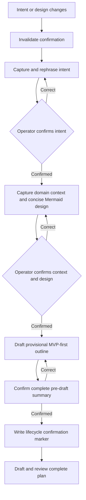

# Approved Design: Confirmed planning context

> Status: approved by the operator on 2026-08-21. Intent or design changes invalidate the current confirmation and return `/cip` to the affected checkpoint.

## Components and boundaries

- Existing `assets/intent.md`, `assets/domain.md`, `assets/design.md`, `assets/decisions.md`, `assets/risks.md`, and `assets/references.md` carry planning meaning.
- `/cip` owns three rephrase-and-confirm checkpoints: intent, domain/design context, and final pre-draft summary.
- Current lifecycle machinery owns one confirmation marker and invalidates it when intent or design changes.
- Existing plan parsing verifies required sections, requirement-to-step mapping, and complete MVP-first routing.
- `/ci`, `/dr`, and autopilot consume layout-resolved assets and current plan state; no separate reader service or state authority exists.

## Program flow

## Optional call stacks

Call stacks are added only when they clarify important control flow. The default workflow above is sufficient for this plan.

## Rejected mechanisms

No Interview Gates schema/service, separate installed reader/writer, lock or repair protocol, version negotiation, revocation state machine, cache, telemetry, new receipt, or architecture contract is part of this design.
