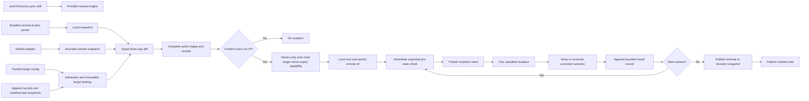

# Program Design

## Ownership

- Consumer-owned tracked config owns allowed organization/repository/project/status identity through registry `consumerFiles[]` initialization metadata.
- `25aa23`'s `Resolve-EpicAssetPath` gives the epic-only `WorkHierarchySync` store ownership of append records, terminal snapshots, receipts, and state; it cannot override config.
- Canonical plan state owns local identity, content, dependencies, and progress.
- Core projection/diff/admission types are provider-neutral. The GitHub adapter owns all REST/GraphQL/auth details.
- The skill owns first-use setup, bounded presentation, immutable-node adoption confirmation, and exact-run apply confirmation.

## Fingerprints

- Managed delimiters are closed v1 tokens carrying kind and canonical local ID. Missing delimiters permit creation; duplicate, nested, mismatched, or malformed delimiters conflict.
- Every fingerprint starts with ASCII domain `skalary/work-hierarchy-sync-fingerprint@1`, NUL, and one-byte field tag: `01` title, `02` managed region, `03` status, `04` parent, `05` project item. Value tag is `00` null or `01` present; present values carry unsigned 64-bit big-endian byte length then bytes. Text is Unicode NFC and UTF-8 without BOM; managed Markdown is LF-rendered and includes delimiters. Compound opaque references frame kind then id with the same length rule. Digest is SHA-256 over the framed bytes.
- The body merge operates on the raw string returned by GitHub. Prefix and suffix outside the managed span are concatenated unchanged around the newly rendered region.
- Three-way comparison uses last-synced, current remote, and current desired fingerprints. Remote-only changes to owned fields conflict; outside-only changes are preserved and do not conflict.

## Apply And Recovery

- Dry run hashes every input/action. Owner-only approval binds run UUID, action digest, actor, host, immutable targets, source commit/tree, config/store digests, random nonce, and start expiry. Consumption under both locks freezes that capability for one uninterrupted 30-minute run; interruption or post-write expiry requires a fresh nonce over the residual-action digest.
- Admission rereads all inputs before the first write. Each action then compares its own expected pre-state immediately before publishing intent.
- Non-idempotent creation is never blindly retried. An uncertain response is reconciled against approved immutable target, run marker, intended name, project membership, and existing journal before retry or `partial`.
- Intent/result records append without rewriting snapshots. At 403 actions, `403 * 2 * 2 KiB = 1,612 KiB`, leaving 436 KiB of the 2 MiB journal for framing/retry/reconciliation metadata. Completed runs retain at most a 1 MiB snapshot + 2 MiB receipt; 20 pairs use 60 MiB. One maximal pinned 2 MiB journal + 1 MiB snapshot + 2 MiB receipt + diagnostics keeps the authority below the 96 MiB aggregate bound.
- The local lock is confined under Git common dir with reparse refusal and is never unlinked. Before product writes, GitHub atomically creates fixed ref `refs/heads/skalary-work-hierarchy-sync-lock-<epic-id>` at the source commit; an existing ref blocks every clone. Terminal publication precedes release. Stale refs require read-only status plus explicit human break-glass; no host/PID metadata grants takeover.
- Durable recovery records contain only schema/run/epic IDs, opaque provider IDs, action kind/index, expected/result digests, state/exit/code, counts, timestamps, and journal links. Input bodies are never persisted. This minimal record is written before mutation and is exempt from free-text redaction because its schema admits no free text. All optional diagnostics pass one fail-closed secret guard before store, plan, log, receipt, or artifact publication; rejection preserves the prior minimal recovery record and yields `partial`.
- Adoption/conflict prompts show derived canonical GitHub URL, issue number, opaque node ID, and digests only, fenced as `UNTRUSTED_REMOTE_DATA`; raw titles, bodies, labels, and provider diagnostics never enter model context. Tests seed directive-shaped content in every remote string field.

## Capacity Equation

- Local maximum: one parent plus 100 children. Parent needs at most create/update, project add, and status = 3 actions. Each child needs create/update, parent link, project add, and status = 4 actions. Maximum = `3 + 100 * 4 = 403`; descriptor cap 403.
- Request worst case: discovery 256; three-attempt reads 768; each action reserves pre-state 1 + mutation 1 + reconciliation 2 = 1,612; capability/lock/status 256. Total `256 + 768 + 1,612 + 256 = 2,892`, below 4,096 with 1,204 spare.
- GraphQL admission estimates each registered query/mutation from a hand-authored operation table, checks observed cost after each response, and keeps 500 reported points unavailable to ordinary actions for reconciliation/terminal status.
- Smoke reserves are disjoint: hosted queue/poll 10 minutes and 128 requests; apply 20 minutes and the product envelope; cleanup 10 minutes and 512 requests. Cancellation or reserve entry blocks new product actions and starts cleanup.

## State And Exit Matrix

Precedence is top-to-bottom when multiple triggers occur; post-write authority outranks pre-write diagnostics.

| Trigger | State | Exit | Required next command |
|---|---|---:|---|
| Cleanup cannot remove a journal-owned node | `residue` | 24 | `Get-WorkHierarchySyncState.ps1`, then `Remove-WorkHierarchySyncSmokeTarget.ps1 -Resume` |
| Mutation intent exists without verified/reconciled result; redaction fails after write | `partial` | 23 | `Get-WorkHierarchySyncState.ps1`, then `Resume-WorkHierarchySync.ps1 -RunId <id>` |
| Lock timeout/stale remote ref/foreign holder | `blocked` | 23 | `Get-WorkHierarchySyncState.ps1`; human break-glass only after holder reconciliation |
| Approval expires or run is interrupted after verified writes | `blocked` | 23 | `Get-WorkHierarchySyncState.ps1`, then approve the emitted residual-action digest |
| Remote/local/config/store pre-state drift or managed conflict | `blocked` | 20 | rerun dry run; approve a new digest |
| Auth, actor, immutable target, or capability mismatch before write | `blocked` | 21 | repair auth/target config; rerun preflight and dry run |
| Schema, admission, request/cost/time/store budget, pre-write redaction, internal error, or exhausted safe-read retry before write | `failed` | 22 | inspect status/diagnostic code; repair and start a new run |
| Hosted cancellation or smoke deadline enters cleanup reserve | `cleanup-pending` | 23 | `Remove-WorkHierarchySyncSmokeTarget.ps1 -Resume` |
| Dry run/no-op/apply/cleanup verifies completely | `completed` | 0 | none |

The descriptor is the executable copy of this matrix; a parity test fails either side on divergence.

## Hosted Trust

- Repo-root live tooling owns resource administration; installed product payload contains no project/repository create/delete command.
- The workflow accepts only `workflow_dispatch` on the canonical repository and exact source SHA, uses a required-reviewer environment, full-SHA-pinned actions, and default `permissions: {}` plus only `contents: read` and `actions: read` where needed.
- A deterministic host script sets the temporary environment secret from `gh auth token` through stdin without model-visible bytes. Cleanup always deletes the secret; failure is residue.
- Workflow input and artifact bind smoke UUID, action digest, immutable targets, cleanup journal digest, workflow/run/job/attempt/artifact IDs, registry digest, and every installed payload hash. The independent verifier chooses by all bindings, re-fetches via authenticated API, and is the only writer of final evidence.

## Port Contract

- `ProviderObjectRef`, `ProviderCollectionRef`, and `ProviderFieldRef` are opaque kind/id pairs.
- `CapabilitySnapshot` states actor plus allowed opaque collections, objects, fields, and operations.
- `RemoteSnapshot` carries opaque identity, typed fingerprints, relations, and provider version metadata.
- `DesiredRelation` names parent/child, collection membership, or field assignment without provider vocabulary.
- `SyncOperation` carries closed create/update/link/assign kinds, expected pre-state, and desired opaque references.
- `SyncOutcome` carries verified/no-op/conflict/unknown/refused plus immutable result refs and diagnostics codes.

## Rejected Alternatives

- Importing the PR-comment transport at runtime: wrong plugin ownership; machine parity tests cover the shared policy instead.
- Automatic marker adoption: remote body markers are untrusted hints, not authority.
- Separate mapping and latest-receipt files: they cannot checkpoint atomically and erase failed-run history.
- Whole-body ownership, automatic reparent/delete/close, or compensating deletion: each can destroy operator state.
- A generic provider framework or architecture contract now: the implementation-level port waits for a second real provider, stable semantics, and two consumers.