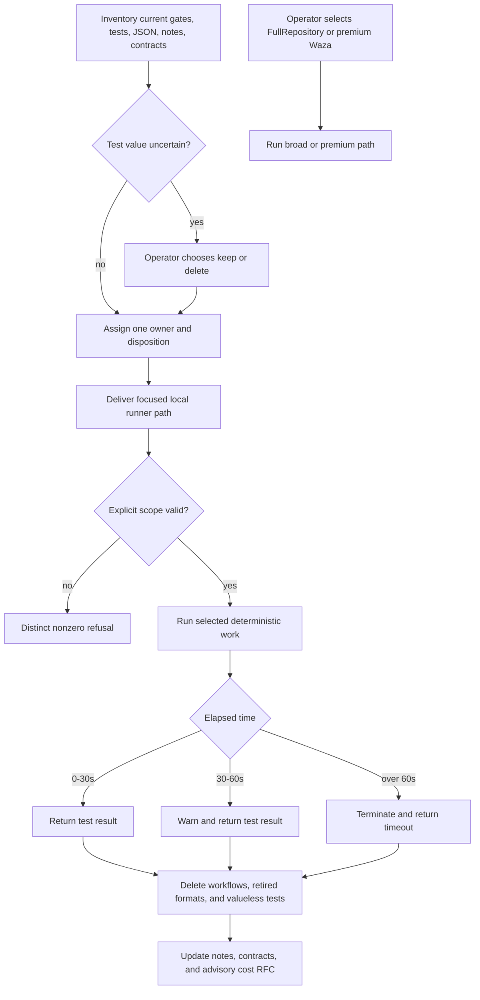

# Approved Design

Preliminary context captured by /cep; /cip must confirm and refine it.

## Components and boundaries

- **Temporary ownership inventory:** `assets/ownership.md` lists active workflow gates, JSON paths,
  tests, design/architecture notes, and contracts exactly once. Rows name the owner child and
  disposition, source category count, value/deletion reason, and named external consumer where
  applicable. Transfer rows use canonical child IDs and are copied into that child's references in
  the same step. `uncertain` test rows form one operator decision gate; the file does not become
  runtime authority or require a permanent parser.
- **Existing local runners:** keep `Run-UnitTests.ps1 -TestPath` for focused unit evidence; add
  explicit plugin selection to `Test-Evals.ps1`; keep `Invoke-WazaEvals.ps1 -Plugin` premium and
  operator-only; extend `validate.ps1` only as needed to accept explicit focused paths. Every focused
  path is canonicalized and physically confined to the repository before execution. Do not add
  wrapper scripts.
- **Explicit wide path:** `-FullRepository` remains the only broad local route. Remove package aliases,
  skill instructions, and workflow calls that invoke it implicitly. “Operator-only” means the switch
  remains available only through a direct explicit CLI invocation; it does not add identity or
  authorization. No ordinary command retries, widens scope, or calls the full suite.
- **Focused timeout:** one timer owns the directly launched child process and its descendants. Wall
  time under 30 seconds returns the child result; 30-60 seconds warns after completion; at 60 seconds
  the runner terminates that process tree and exits `13` (`FocusedTimeout`). No recovery state is kept.
- **Local-only repository rules:** delete `.github/workflows/` and workflow-only tests/support. Rewrite
  `ci-gates.design.md`, `dev-rules.design.md`, `copilot-customizations.design.md`, architecture indexes,
  and directly invalidated provisional contracts in the same MVP step so no active authority requires
  a deleted workflow. Remaining owner-local synchronization follows its corresponding deletion.
- **Format and test cleanup:** baseline-owned internal JSON is converted to strict Markdown or deleted.
  Each deletion updates its producer and consumers in the same implementation step. Baseline-owned
  tests survive only when mapped to current user behavior, an external format, or a high-impact
  regression.
- **Bounded history reuse:** retain `Get-PlanArtifactConsumerContext.ps1` and its current limits. Remove
  receipt-specific coupling only in the child that owns the affected consumer; do not create a second
  reader.
- **Advisory cost RFC:** create
  `docs/design-notes/explorations/agent-cost-optimization.design.md`. It records the accepted budget:
  2 agent calls by default, 5 maximum; primary model plus availability fallback, with extra reviewers
  only when justified; current plan/epic plus at most 5 supporting artifacts; 600-word instruction
  target and 1,200-word cap. Consumer children use focused fixtures rather than a policy service.

## Program flow

## Optional call stacks

The Mermaid flow is sufficient; no call stack adds useful information.

## Provisional delivery outline

1. **Usable local-first MVP:** inventory current ownership, obtain operator dispositions for uncertain
   tests, deliver focused deterministic commands, remove GitHub workflows, and remove implicit
   full-repository aliases.
2. **Value and format cleanup:** apply baseline-owned test dispositions, remove tier/profile residue,
   convert or delete baseline-owned internal JSON, and synchronize affected notes/contracts.
3. **Ergonomic shared rules:** finish equivalent informed choices, direct-script approval guidance,
   bounded history reuse, the advisory cost RFC, and focused final reconciliation.
