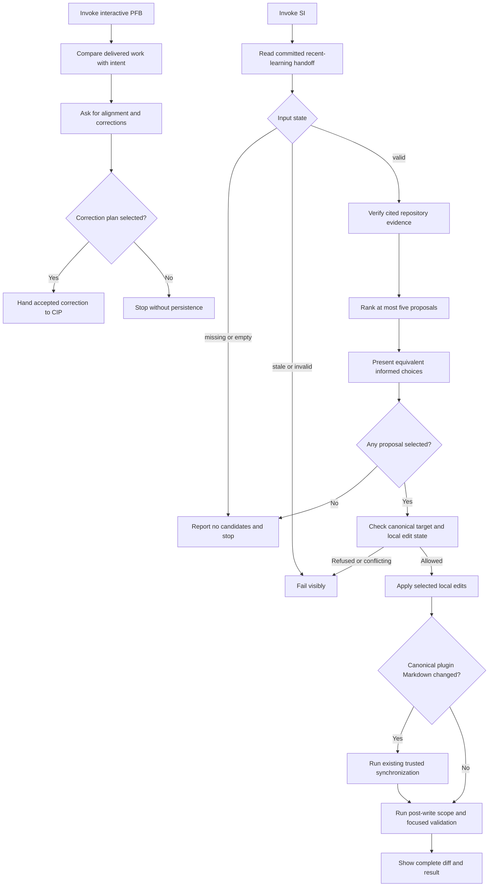

# Approved Design

## Components and boundaries

- **Bounded reader.** Keep `Get-SiHarvest.ps1` as a read-only adapter over the one committed
  recent-learning handoff. Remove receipt issuance and all state-store dependencies while retaining
  strict source-plan, source-commit, ancestry, citation, size, count, secret, and fence checks.
- **Direct `/si`.** Resolve the selected or latest completed plan and current Git base, read the handoff,
  verify cited repository evidence, rank no more than five proposals, and present equivalent informed
  choices in VS Code and Copilot CLI. No selection means no mutation.
- **Canonical write guard.** Validate planned targets before mutation and resulting touched paths after
  mutation. Allow only `.github/copilot-instructions.md`, `plugins/*/skills/**/*.md`,
  `plugins/*/agents/**/*.md`, `plugins/*/prompts/**/*.md`, `docs/design-notes/**/*.md`, and
  `docs/architecture-notes/**/*.md`. Physical path escape, workflows/actions, generated copies,
  executable code, plans, and runtime state are closed refusals.
- **Local application.** Apply selected edits in the current worktree. If a selected target already has
  unrelated edits, stop for operator action. When canonical plugin Markdown changes, run the existing
  trusted synchronization sequence; generated outputs are mechanical consequences, not direct SI
  targets. Show the complete diff and focused validation. Failure leaves the diff visible.
- **Stateless `/pfb`.** Preserve the evidence-cited five-section comparison and `full|partial|missed`
  verdict. Do not persist it. If the operator wants a correction, pass the accepted correction directly
  to `/cip`; headless completion skips feedback.
- **Retirement cut.** Delete the queue, due, run, receipt, CAS, repair, archive, cross-repository,
  worktree/branch/PR, schema, scaffold, and compatibility surfaces together with their callers and tests.

## Program flow

## Optional call stacks

The Mermaid flow is sufficient. The retained scripts perform bounded reads, path checks, and existing
repository synchronization; plain skill instructions own ranking and interaction.
