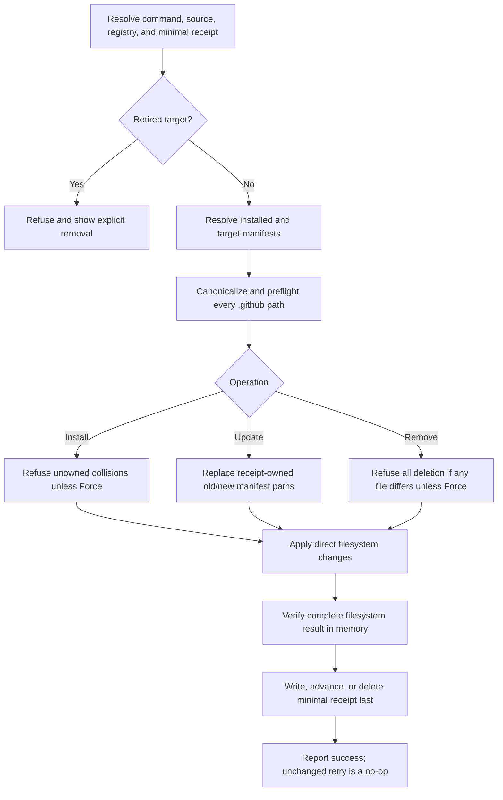

# Approved Design

## Components and boundaries

- `Install-Plugin.ps1`, `Update-Plugin.ps1`, and `Remove-Plugin.ps1` remain the stable mutating entry
  points. `Find-Plugin.ps1` and `Get-Plugin.ps1` remain read-only catalog/installed views.
- `_Common.ps1` retains source identity, semver, JSON I/O, manifest dependency ordering, and physical
  `.github` confinement. Transaction, lock, recovery, retirement-state, and file-hash receipt helpers
  are deleted.
- Minimal receipts remain per plugin and merge-friendly. Direct closed-shape validation replaces the
  receipt schema and legacy readers.
- Install resolves the requested immutable source, preflights every destination, refuses unowned
  collisions unless forced, writes payload, verifies bytes, then writes receipts.
- Update reads the minimal receipt, resolves both installed and target immutable manifests, replaces
  their union of confined paths for that plugin, verifies the target result, then advances the receipt.
  A matching receipt is explicit authority to overwrite local edits in those paths.
- Remove resolves the exact installed manifest from the receipt ref and preflights all present paths.
  Any differing path aborts the whole unforced operation before deletion; forced removal deletes the
  confined set. The receipt is deleted last.
- `registry-retirements.json` remains the direct catalog source for published retired-name and pinned
  manifest metadata. Install/update refuse retired names. Already-installed retired plugins require
  explicit removal; no unrelated command previews or applies retirement.
- Existing source-to-bundle-to-registry-to-marketplace-to-dogfood generators remain the only
  distribution path.

## Program flow

## Optional call stacks

The Mermaid flow is sufficient. Implementation should reuse current manifest/source and confinement
helpers rather than introduce another orchestration layer.

## Failure behavior

- Source/ref, receipt, registry, or manifest validation fails before mutation.
- A mid-operation filesystem error stops non-successfully and leaves observable files plus the prior
  receipt state. No rollback is attempted or claimed.
- Retry uses the prior receipt and desired manifest to converge. A partial install with no receipt may
  require an operator-reviewed `-Force` retry because existing targets are intentionally unowned.
- Missing installed files during removal are already converged; differing present files require
  `-Force`.

## Dubious decisions

- Explicit update overwrites local edits in paths owned by a matching plugin/source receipt because the
  minimal receipt intentionally stores no file hashes. Revisit only if preserving edits becomes a
  current operator need.
- Removing locks and rollback can expose partial filesystem state after interruption. Receipt-last
  ordering, visible failure, and convergent retry are accepted for one trusted operator. Revisit if
  concurrent writers or unattended mutation become supported.
