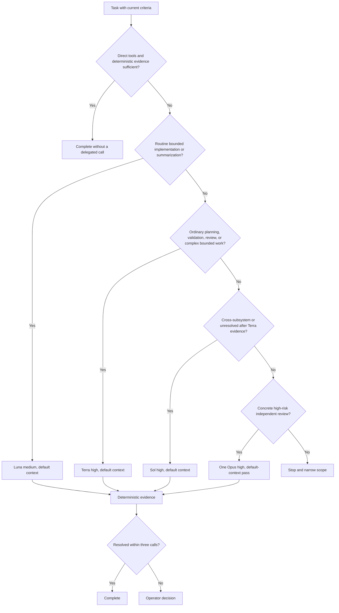

# Approved Design

## Components and boundaries

- **Budget policy.** The agent-cost design note owns one dated, human-readable table. It states the
  180,000-credit operating target, 20,000-credit reserve, current official rates, task roles, fallbacks,
  reasoning effort, default context, and observable escalation conditions. It is guidance, not a
  runtime router or price registry.
- **Model ladder.**

  | Tier | Primary | Replacement fallback | Effort/context | Admitted work |
  |---|---|---|---|---|
  | Routine | GPT-5.6 Luna | GPT-5 mini | medium/default | Bounded implementation, extraction, summaries, documentation, and straightforward fixes |
  | Standard | GPT-5.6 Terra | Claude Sonnet 5 | high/default | Planning, acceptance validation, ordinary CR/DR, and complex bounded implementation |
  | Deep | GPT-5.6 Sol | GPT-5.6 Terra | high/default | Cross-subsystem orchestration or diagnosis still unresolved after evidence-backed Terra work |
  | Independent | Claude Opus 5 | Claude Sonnet 5 | high/default | One concrete high-risk security, concurrency, destructive, correctness, or architecture pass |

  A fallback replaces an unavailable call. Sol and Opus are never routine fallbacks.
- **Delegation.** Direct repository work is the default and uses zero delegated calls. One combined
  specialist is normal only when a concrete unresolved concern needs separate context. The hard ceiling
  is three calls per task or plan step, including retries and replacements; a fourth requires a new
  operator decision. Deterministic tests, linters, parsers, and repository facts are the normal Judge.
- **Context.** Remove the configurable context tier from autopilot and do not pass `--context`; Copilot's
  default tier is the only active path. High-frequency skills attach at most three selected artifacts,
  target 400 delegated-prompt words, and stop to narrow before 800.
- **Progressive disclosure.** The `autopilot`, `cep`, `cip`, `ci`, `cr`, `dr`, and `si` entrypoints are
  at most 4 KiB each. Rare recovery, provider, formatting, and detailed rubric paths move to installed
  assets that are opened only after the relevant branch is selected. No summary service or generated
  instruction graph is added.
- **Autopilot.** The shipped example and repository config default to Luna with medium reasoning.
  Operators may explicitly select Terra for a complex plan and Sol only for the deep criteria above.
  Removing the context field is an intentional compatibility break under the epic's single-operator
  boundary.
- **Reviews.** A selected ordinary review is one Terra call. Opus may add one independent pass only when
  the scope exposes a concrete high-risk path. No fixed concern matrix, automatic second Judge, model
  panel, or unchanged-scope rerun returns.
- **Premium evals.** Each of the 20 current waza tasks receives one explicit disposition:
  deterministic grader, retained subjective Terra judge, or deletion if it protects no current value.
  Skill execution uses Luna. Tier-2 remains direct, explicit, plugin-focused, and absent from all
  deterministic validation.
- **Distribution.** Canonical plugin sources remain authoritative. Existing sync and focused
  consumer-install checks update `.github` dogfood, registry, marketplace, allowlist, and shipped assets;
  no second model-policy configuration is introduced.

## Program flow

## Optional call stacks

The Mermaid flow is sufficient. Model routing remains instruction-owned and direct; no runtime call
stack or policy engine is added.
