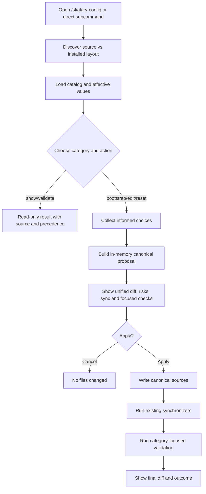

# Approved Design

## Components and boundaries

| Component | Responsibility |
|---|---|
| `skalary-config` skill | Guided category menu plus direct subcommands; owns no subsystem setting semantics. |
| Configuration catalog | Human-readable skill asset listing category, canonical/default/generated paths, precedence, sensitivity, bootstrap, writer/synchronizer, and focused validator. |
| Surface adapters | Small instruction branches that read/write through existing subsystem files or scripts; no generic configuration abstraction. |
| Proposal renderer | Holds intended edits in session memory and shows one unified diff plus follow-up actions before Apply. |
| Existing writers/synchronizers | `Set-ScriptApproval`, subsystem bootstrap scripts, dogfood/catalog generators, and final child equivalents remain authoritative. |
| Focused validation | Runs only validators/tests associated with changed categories and reports unsupported or failed follow-up explicitly. |

## Program flow

## Configuration categories

| Category | Normal operations | Restricted behavior |
|---|---|---|
| Autopilot | Root project config, model/context/effort, runtime/build/test/iterations, selected bootstrap | Host command and executable values require explicit warning; no automatic executable creation. |
| Models and reviews | Effective assignments and final simplified review profiles | Host allowlist changes are advanced; invalid host/model pairs are refused. |
| Local review standards | Show, bootstrap strict Markdown, edit localizable entries | Generic/generated standards remain subsystem-owned. |
| Terminal approvals | Add/remove exact read-only focused script approvals | Mutating or secret-bearing auto-approval is refused. |
| Evals | Batch-update per-spec model/judge/trial/timeout and credential-target names | Waza YAML remains per plugin; toolchain checksums/pins are advanced. |
| Design and architecture | Scaffold/status and direct links to owning flows | No generic rewrite or architecture lock promotion. |
| Plugin distribution | Show manifests/catalog precedence; advanced manifest edits plus regeneration | Generated registry/marketplace/README and retirement history are not direct edit targets. |
| Repository/toolchain policy | Explain effective instruction/toolchain settings | Show-only by default; advanced mode retains subsystem validation. |

## Design decisions

- Keep one Markdown catalog rather than adding configuration declarations to every plugin manifest.
- Reuse current examples for defaults so reset does not create a second default store.
- Preserve per-plugin external formats such as Waza YAML and plugin manifests.
- Separate project/operator configuration from advanced maintainer policy in the first menu.
- Delay detailed planning until `367e9a`, `3a4498`, and `623cc2` land; their final surfaces replace this
  preliminary inventory without compatibility adapters.
