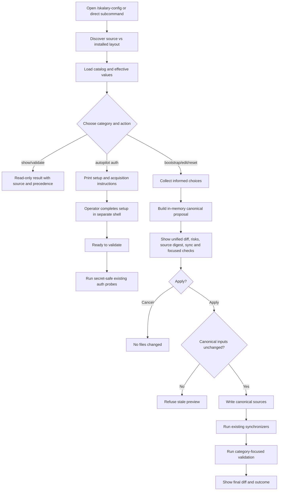

# Approved Design

## Components and boundaries

| Component | Responsibility |
|---|---|
| `skalary-config` skill | Guided category menu plus direct subcommands; owns no subsystem setting semantics. |
| Configuration catalog | Human-readable skill asset listing category, canonical/default/generated paths, precedence, sensitivity, bootstrap, writer/synchronizer, and focused validator. |
| Read-only discovery | One small skill-local command resolves source versus installed layout, effective values, validation, current diff, and proposed category changes without reading credential values or writing files. |
| Bounded apply adapter | Accepts one closed category and known keys, rechecks a transient preview digest, then delegates to existing writers or performs the smallest format-specific canonical edit; it accepts no arbitrary target path and stores no proposal state. |
| Proposal renderer | Holds intended edits and the source digest in session memory and shows one unified secret-redacted diff plus follow-up actions before Apply. |
| Autopilot auth guide | Selects instructions from `copilotAuth`, `gitProvider`, and `gitAuth`, prints official acquisition links plus placeholder-only storage/login commands, pauses for separate-shell setup, then invokes a secret-safe wrapper over the existing credential and auth validators. |
| Existing writers/synchronizers | `Set-ScriptApproval`, subsystem bootstrap scripts, dogfood/catalog generators, and final child equivalents remain authoritative. |
| Focused validation | Runs only validators/tests associated with changed categories and reports unsupported or failed follow-up explicitly. |

## Program flow

## Configuration categories

| Category | Normal operations | Restricted behavior |
|---|---|---|
| Autopilot | Root project config, model/effort/context, runtime/build/test/iterations, selected bootstrap, auth setup instructions, and post-setup validation | Host command and executable values require explicit warning; shipped context defaults to `default`, `long_context` requires an advanced cost warning, and token values never enter prompts or command arguments. |
| Models and reviews | Effective assignments and final simplified review profiles | Host allowlist changes are advanced; invalid host/model pairs are refused. |
| Local review standards | Show, bootstrap strict Markdown, edit localizable entries | Generic/generated standards remain subsystem-owned. |
| Terminal approvals | Add/remove exact read-only focused script approvals | Mutating or secret-bearing auto-approval is refused. |
| Evals | Batch-update per-spec model/judge/trial/timeout and credential-target names | Waza YAML remains per plugin; toolchain checksums/pins are advanced. |
| Design and architecture | Scaffold/status and direct links to owning flows | No generic rewrite or architecture lock promotion. |
| Plugin distribution | Show manifests/catalog precedence; advanced manifest edits plus regeneration | Generated registry/marketplace/README and retirement history are not direct edit targets. |
| Repository/toolchain policy | Explain effective instruction/toolchain settings | Show-only by default; advanced mode retains subsystem validation. |

## Design decisions

- Keep one Markdown catalog rather than adding configuration declarations to every plugin manifest.
- Keep the runtime adapter local and closed: category-specific handlers and fixed canonical paths, not a
  generic configuration framework or Markdown-driven execution engine.
- Reuse current examples for defaults so reset does not create a second default store.
- Preserve per-plugin external formats such as Waza YAML and plugin manifests.
- Separate project/operator configuration from advanced maintainer policy in the first menu.
- Treat a source change between preview and Apply as a refusal; the operator previews again rather than
  relying on a durable proposal or merge protocol.
- Preserve `long_context` as an advanced opt-in while every shipped configuration and reset default uses
  `default`.
- Keep secret setup human-controlled. The skill prints conditional GitHub PAT/OAuth and ADO acquisition,
  permission, storage, and login steps with placeholders, then waits for Ready to validate; it never
  creates, requests, displays, or stores the secret itself.
- Compose validation without exposing values. A small installed wrapper retrieves credentials and calls
  existing `validate-auth.ps1` internally, returning only sanitized capability results and exact
  remediation.
