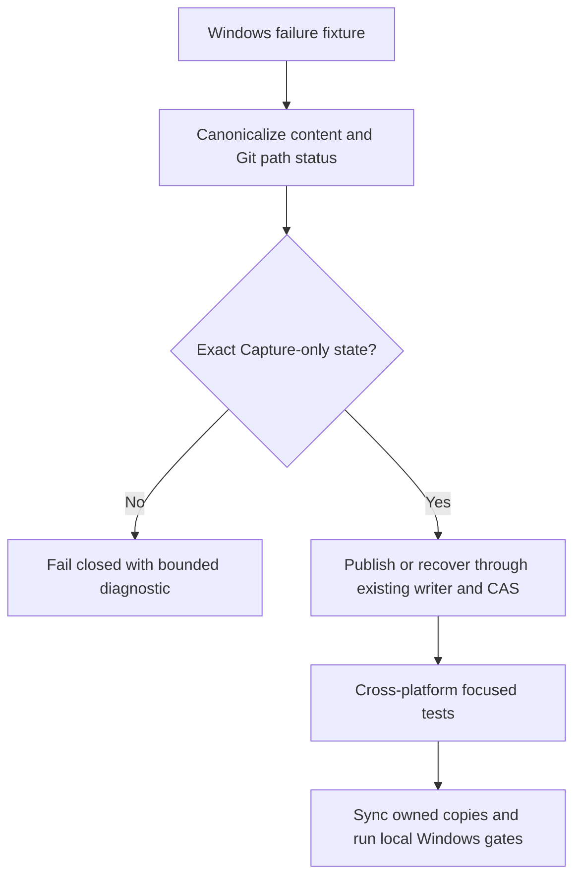

# Approved Design

<!--
Describe the agreed program shape, not implementation detail. Replace every TBD and confirm the result with
the operator before detailed plan drafting. A Mermaid program flow is required. Call stacks are optional.
-->

## Components and boundaries

- `scripts/skalary/EpicAutopilot.psm1` owns final-evidence status, publication, and interrupted-residue recovery.
- `tests/autopilot/EpicAutopilot.Tests.ps1` owns deterministic CRLF, long-path, missing-state, and residue fixtures.
- Existing plugin generation and dogfood synchronization distribute the canonical script; no parallel implementation is added.
- The repair plan is independent of `a5ad22` lifecycle finalization and must not mutate its review or receipt artifacts.

## Program flow

## Optional call stacks

The Mermaid flow is sufficient; existing final-crosscheck call structure remains unchanged.
