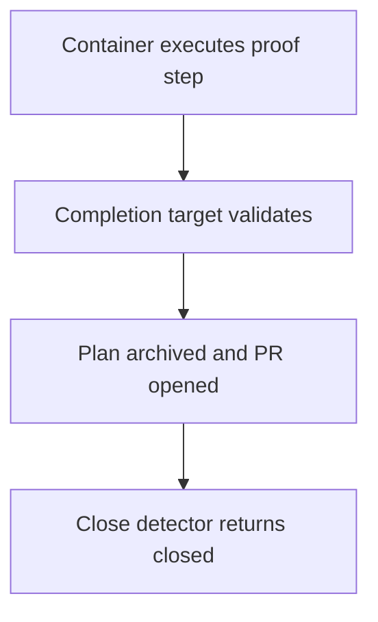

# Approved Design

<!--
Describe the agreed program shape, not implementation detail. Replace every TBD and confirm the result with
the operator before detailed plan drafting. A Mermaid program flow is required. Call stacks are optional.
-->

## Components and boundaries

- One phase creates one isolated text file.
- Existing autopilot finalization validates it, archives this plan, opens a pull request, and runs terminal
  close proof.

## Program flow

## Optional call stacks

The Mermaid flow is sufficient.
