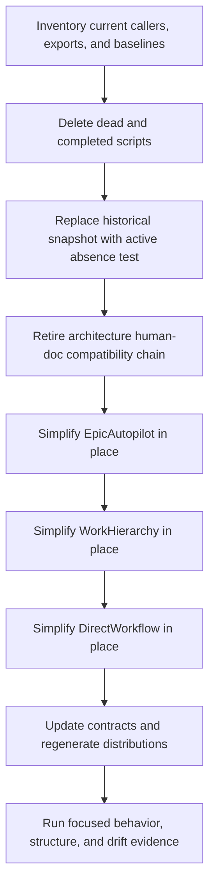

# Approved Design

## Components and boundaries

1. **Closed deletions.** Remove the unused plugin-retirement history wrapper/comparator, unused review
   test wrapper, completed prefix migration and its tests, and all references owned solely by them.
2. **Current-state retirement proof.** Replace the 34-file architecture-test historical snapshot,
   manifest gate, and byte-binding test with one focused test that scans active roots for prohibited
   retired paths and symbols. Git history remains the source for former implementation bytes.
3. **Markdown-only architecture notes.** Delete `architecture.human.md`, its generator, shared digest
   helper, template, freshness gate, manifest mappings, generated copies, compatibility-specific evals,
   consumer-fixture branches, and guidance. Keep direct JSON-contract validation and Markdown note/ADR
   workflows.
4. **Evidence-led in-place module reduction.** For each large module, inventory private functions and
   branches against callers, tests, and active contracts. Delete only redundant or superseded paths.
   Preserve exact exports and focused behavior. Do not create replacement production modules.
5. **Owned convergence.** Update active design/architecture notes, then run existing sync and catalog
   generators so installed copies match canonical source.

Structural baselines use PowerShell parser tokens, counting unique source lines containing a
non-comment/non-newline token, and AST function definitions minus exported functions:

| Module | Non-comment lines | Private functions | Exported functions |
|---|---:|---:|---:|
| `EpicAutopilot.psm1` | 2,083 | 44 | 1 |
| `WorkHierarchy.psm1` | 1,636 | 19 | 16 |
| `DirectWorkflow.psm1` | 708 | 8 | 7 |

Completion requires both measured values to decrease for every module. This is a one-time proof against
the recorded baseline, not permission to compress statements, remove clarifying comments, or add a
parallel module.

## Program flow

## Optional call stacks

The Mermaid flow is sufficient. Each module keeps its existing public entrypoint/caller shape.
