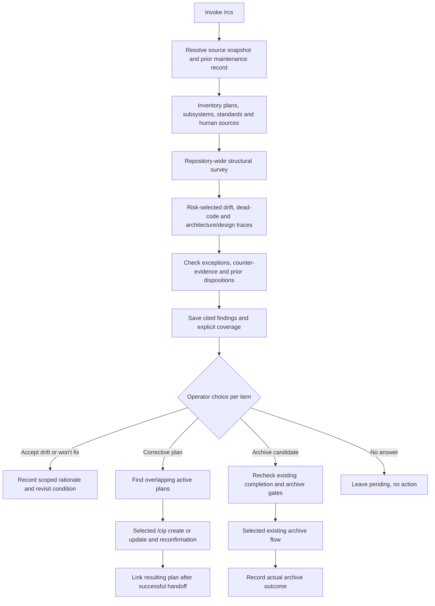

# Approved Design

Program shape and final detailed criteria confirmed by the operator on 2026-10-03 after the selected
pre-confirmation edits.

## Components and boundaries

| Component | Responsibility |
|---|---|
| Thin `/rcs` skill | Resolve current scope, load on-demand guidance, run direct-first survey/traces, publish findings, request decisions. |
| Audit guidance | Human-source precedence, risk selection, coding/design/architecture checks, dead-code evidence, uncertainty and coverage. |
| Existing plan helpers | Inventory active/archived plans and epics, resolve sections/state, discover relevant intent with provenance, read bounded historical assets. |
| Plugin-owned record helper/template | Read and update one fixed Markdown document, preserving operator decisions and prose; apply existing physical path and secret guards. |
| Decision guidance | Scoped acceptance/won't-fix, changed-basis revisit, duplicate-plan check, existing `/cip`/architecture/archive handoffs. |
| Existing distribution/evals | Independently installable payload closure, deterministic helper/structural tests, consumer fixtures, explicit optional premium route. |

No new agent, database, authority layer, schemas, lifecycle, or fixed review panel is needed.
Shared canonical helpers are bundled through manifest-declared closures; plugin-owned record logic stays
in the plugin. Installed runtime never imports another plugin's authoring path.

## Program flow

## Discovery and evidence

Inventory all discoverable plans/epics and repository subsystems without loading all historical assets.
Derive Skalary subsystems from existing active doc indexes, plugin manifests and script/command entry
points; for foreign repositories use existing manifests, build/project files, commands and layout
evidence. Record uncertain/unclassified areas rather than create a subsystem registry.
Probe the plan corpus or use PlanState inventory before calling `Get-PlanIndex.ps1`; its absent-corpus
exception is not an empty discovery result. Repositories without plans remain supported with a gap.
Use current index-led matching by relevant path, subsystem, outcome and expectation, plus explicit
selected IDs. When integrated, the enhanced existing index adds bounded intent/epic snippets with
provenance; otherwise use current inventory and bounded intent reads and disclose search/epic-context
limitations. Missing enhanced snippets do not block v1 or justify a parallel index.
Deep historical intake remains at most
three selected artifacts per review request; do not evade the bound by repeated automated batches.
If the cap leaves relevant sources unread, list them as gaps and let the operator select further scope.
Active standards/notes and current code are inspected as needed for selected traces; do not bulk-load
every document, log or archive.

Human sources include saved intent, requirements, decisions/RFCs, contracts, design notes, operator docs,
README/instructions, and relevant cited discussions/issues or supplied references available locally.
Do not imply inaccessible chat/remote history was checked. Network evidence is optional read-only
lookup for a named consequential uncertainty, not a routine crawl or private-code query.

Frame accepted consumer Markdown with `ConvertTo-UntrustedReviewBlock` once before model consumption;
preserve the historical reader's already-framed output without nesting it or losing provenance.
Capture full current `HEAD`, dirty paths relevant to the audit, and concrete code citations. A valid
static call/behavior trace is evidence; historical report verdicts and clean worktree state are not.
Check guards, deliberate exceptions, supersession, competing requirements, tests and supported entry
points before classifying findings. Preserve local standards over generic preferences, not over
demonstrated defects. For security claims retain the existing four-link threat rubric.

## Central record

Readable sections: source/scope, survey/coverage, findings, and operator decisions. Each finding has
a stable local heading/id, kind, subject/scope, source citations, current code evidence and uncertainty,
impact, recommended action, benefits/tradeoffs, effort/complexity 1-10, and any linked corrective plan.
Each explicit decision retains date, operator-selected disposition, rationale, affected scope,
assumptions/revisit condition, and evidence references. No hashes, authenticity claim, or ticket state
machine is added. Reopen by recording the changed basis while preserving previous rationale.

The skill may propose reuse of a stable finding ID by comparing subject/scope and citations, but the
helper matches IDs and associated subject/scope/citations exactly, without semantic inference.
Ambiguous reuse asks the operator, with a new ID as the default, rather than silently merging distinct
findings. Preserve unrelated human prose. Repeated unchanged
findings do not create duplicates or erase dispositions. Partial runs do not delete unseen entries or
close them as resolved. Completed fixes are rechecked against current code before noting resolution;
creating a plan alone does not mean a fix is delivered.

The plugin-owned helper uses the compile-time literal `docs/repository-maintenance.md`,
`Resolve-PhysicalRepoPath`, per-component reparse checks from repository root through `docs` and target,
physical containment checks, and existing `Find-HighConfidenceSecret`/`Protect-HighConfidenceSecret`
publication guards. Do not reuse plan-corpus confinement or `Write-DirectReviewReport` for this path.
The manifest declares one literal scaffold with no scaffold `confine` helper. Runtime write checks
remain separate from that declaration. The helper refuses links/reparse points,
invalid UTF-8, malformed supported sections, secret-containing publication, and oversized input/output.
Use a 128-KiB UTF-8 record limit for v1; exceeding it reports an explicit operator-maintenance stop,
not truncation, automatic rollover, or a second record. Invocation authorizes findings publication
only to this document. Decisions and non-record mutation require their explicit selected flow.
Writer failures leave the original record unchanged and report failure.

## Dead code and overall improvements

Survey codebase architecture/design beyond plan drift. Surface concrete costly coupling, duplicated
responsibility, inconsistent boundaries, avoidable complexity, or design-standard violations with
actual locations and tradeoffs. Optional preferences are labeled improvements, not defects.

Dead-code tracing uses available language tooling and repository searches. Consider public/exported
APIs, shell/package/skill entry points, reflection/DI/configuration/event registration, build/generated
paths, tests, manual tools, and documented external consumers. Zero references is insufficient.
State the investigated roots, known indirect use, and limits. Supported manual tools are reachable
through operator invocation even without internal callers. Proposed removals are grouped by owned
source/consumer closure and routed to a plan; `/rcs` does not delete them.

## Operator actions and archive boundary

Show complex choices with context, concrete example, benefits, pros/cons, recommendation, and effort/
complexity; use equivalent native host choices. No answer leaves pending.
Accept/won't-fix is specific, dated and scoped. An unchanged acceptance suppresses repeated prompting,
not evidence gathering or a new defect. Changed scope/assumptions/evidence gets a visible revisit.

For corrective work, search active plans for overlap and offer linking/updating through `/cip` before
new creation. Pass original source statements, code evidence, desired correction, boundaries and
verification; retain `/cip`'s normal interview/review/confirmation. Link only the successful outcome.
Criteria changes return to affected-plan reconfirmation; locked contracts use their approval flow.

Archive is a separate selected handoff after current completion/state checks, not a byproduct of
accepted drift. Reuse existing plan completion/archival instructions and `Archive-Epic.ps1` where
applicable, preserving identity/assets and refreshing epic child tables. Refuse pending steps,
missing completion evidence, unarchived epic children, destination collisions, links, and absent
capability. Inspect the actual installed standalone-plan archive route during implementation;
there is no `Archive-Plan.ps1` API assumed by this plan.

## Validation and limitations

Deterministic tests prove helpers, guards, file preservation, choice wiring, payload closure, and
structural instruction contracts. Disposable scenario traces exercise false-positive handling and
the complete proposed-action path. Neither proves recall across arbitrary repositories.
Routine validation is focused and local; broad/premium evals need a separate operator decision.
Extend the existing script-sync optional-input allowlist for this consumer's actually referenced
`docs/design-notes`, `docs/architecture-notes`, `docs/implementation-plans`, and
`docs/review-standards.md` inputs, using the existing exact/prefix representation. These are
consumer-owned reads, not first-use writes/scaffolds. Add no grammar or lifecycle.
Use existing direct-first aliases and three-call ceiling, including retries/replacements; do not
introduce a default second reviewer or unchanged-scope rerun.

## Dubious decisions

The operator selected one central record over distributed owning documents. This makes cross-run
decisions easy to inspect but duplicates references to source decisions. The record is advisory:
source contracts/criteria remain authoritative, and approved changes are linked to their owning flow.
Revisit if record size or inconsistent dispositions prevents reliable bounded intake.

## Optional call stacks

The program flow is sufficient; script signatures are verified against current integrated sources
before implementation rather than frozen here from another branch's summary.
