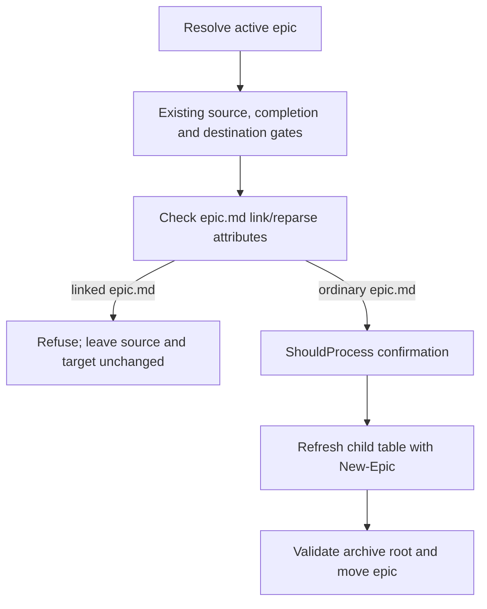

# Approved Design

<!--
Lightweight RFC for operator review: outcome, proposed behavior, boundaries, important flows, tradeoffs, and
open choices. Requirements and decisions remain in their own assets and are linked, not duplicated.
-->

## Outcome and proposed behavior

- Add a local epic.md link/reparse attribute check to `Archive-Epic.ps1` before `ShouldProcess`
  and the refresh/move sequence, leaving existing completion/collision checks in place.
- If epic.md is a link/reparse point, stop with a
  clear error; do not call `New-Epic.ps1`, rewrite the child table, or move the source.
- Keep the guard local to epic archival and retain `New-Epic.ps1` as the child-table writer.
- `Get-EpicInventory` currently reads `epic.md` while resolving the epic. That preceding read is
  read-only and remains unchanged; this plan prevents a subsequent write through the link.

## Components and boundaries

- `Archive-Epic.ps1`: epic.md attribute guard; existing completion and destination gates;
  confirmation; child-table refresh; archive-root validation; directory move.
- `New-Epic.ps1`: existing generated child-table owner, invoked only after preflight and confirmation.
- `tests/skalary/ArchiveEpic.Tests.ps1`: one isolated real file-symlink regression and existing cases.

## Program flow

## Tradeoffs and open choices

- Reuses the existing archive command and child-table writer; no wrapper, generic filesystem service,
  lock, journal, or rollback mechanism.
- The preflight is a point-in-time check. Concurrent local replacement between validation and move is
  not addressed; the repository's trusted single-operator model does not justify a new lock.
- Windows file-symlink fixture creation requires capability unavailable on the current host. Use an
  available capable non-elevated host, such as Linux; do not elevate the app or change host settings.
  If none is available, stop with explicit unverified acceptance.
- No recursive descendant guard or separate linked-source WhatIf criterion: neither is needed to
  prove prevention of the demonstrated epic.md write-through.

The Mermaid flow is sufficient.
