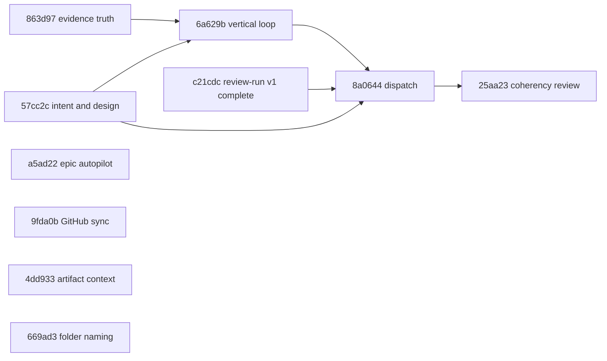

# bcece1: Intent-to-delivery vertical workflow
<!-- epic-id: bcece1 -->
<!-- Folder naming: epics/<yyyy-mm-dd>-<6hex>-<slug> · epic-id is the canonical handle. -->

## Goal

Make `/cip`, `/cep`, and `/ci` produce and execute complete, operator-aligned plans as usable vertical increments, with confirmed intent and concise program design agreed before implementation.

**Desired outcome.** `/cip` captures and confirms the operator's complete outcome, MVP, end-user experience, and concise Mermaid-backed design. `/ci` admits and implements one vertical phase at a time, checks truthful evidence and uncertainty, and supports one-phase stop/resume. A small run-scoped dispatcher declares specialized-agent work before execution. `/cep` reviews an accepted epic cut for coherency and proportionality before finalization. Related plan artifacts can be loaded through one bounded resolver with provenance. GitHub-only synchronization projects local epics/plans to managed work items. A host loop can run eligible epic children sequentially through the existing per-plan launcher.

**Success signals.**

- Three interview checkpoints and one lifecycle-owned confirmation keep intent/design current without a second state platform.
- Plans cover the complete outcome in MVP-first vertical phases; each phase leaves inspectable behavior.
- Phase admission, evidence crosscheck, decision/uncertainty capture, and operator stops reuse current plan/evidence/workflow-note machinery.
- Every fleet declares selected work, omissions, ready waves, and final attendance, with at most four tasks admitted per run.
- Epic coherency review rejects speculative infrastructure, duplicated mechanisms, unclear ownership, and dependencies unsupported by delivered behavior.
- Cross-plan context is selected by resolved plan ID and allowlisted kind, bounded, treated as untrusted, and recorded in existing references/review scope.
- New hash-schema plans receive epic/standalone prefixes while canonical IDs and legacy numbered plans remain stable; migration is operator-run and `-WhatIf` first.
- GitHub dry run/apply converges without duplicate work and refuses conflicts; Azure DevOps remains an unimplemented interface seam.
- Whole-epic autopilot runs one child at a time, stops for operator merge, refreshes the graph, and finishes with coherency or epic-intent review.

**Non-goals.**

- New architecture contracts, protocol families, state-machine platforms, activation transactions, or compatibility layers without a demonstrated cross-plan invariant.
- Live Azure DevOps implementation, provider capability publication, or elaborate hosted credential/smoke infrastructure.
- A cross-run fleet scheduler, global ledger, clone manager, or replacement for review-run v1.
- Automatic bulk migration of active/archived plan folders.
- Parallel child containers in epic autopilot v1.
- Reducing `/cip` to an MVP-only or partial implementation plan.

**Definition of done.** A complete implementation can move from confirmed intent and concise design through MVP-first vertical execution, truthful phase checks, bounded agent dispatch, proportional epic review, optional related-plan context, GitHub hierarchy synchronization, and sequential epic autopilot without introducing a second platform for behavior already owned by current workflow machinery.

## Child plans

<!-- child-plans:start -->
| Plan | Slug | Depends on |
|---|---|---|
| `57cc2c` | intent-capture-and-rfc | — |
| `8a0644` | dispatch-plan-up-front | `57cc2c`, `6a629b`, `c21cdc` |
| `25aa23` | epic-coherency-review | `8a0644` |
| `4dd933` | cross-plan-artifact-context | — |
| `669ad3` | epic-prefixed-plan-folder-naming | — |
| `6a629b` | vertical-implementation-requirement-loop | `57cc2c`, `863d97` |
| `9fda0b` | github-work-hierarchy-synchronization | — |
| `a5ad22` | epic-autopilot-orchestration | — |
| `cda9da` | architecture-test-retirement | — |
<!-- child-plans:end -->

Membership is the `<!-- epic: bcece1 -->` marker in each child `plan.md`. The table is the generated mirror of those markers and dependency headers. `cda9da` is archived and complete; `863d97` is an external active dependency supplying truthful evidence behavior to `6a629b`. Run `Get-PlanState bcece1` for the live rollup and next unblocked child.

## Accepted simplified cut

| Child | Outcome | Mechanism boundary |
|---|---|---|
| `57cc2c` | Confirm operator intent and concise design | Existing Markdown assets, three checkpoints, one lifecycle marker, invalidation on intent/design edits |
| `6a629b` | Implement and verify vertical phases | Existing plan parser/state, evidence crosscheck, `Add-WorkflowNote`, operator checkpoint, one-phase stop/resume |
| `8a0644` | Declare and dispatch bounded agent work | Pure planner plus run-scoped adapter; review-run v1 remains authoritative |
| `25aa23` | Prevent incoherent or overcomplicated epic cuts | Existing design review plus proportionality rubric and one compact operator-resolved verdict |
| `4dd933` | Load related-plan artifacts with provenance | One resolver beside `Get-PlanIndex`, existing layout resolution, path/byte bounds |
| `669ad3` | Prefix new hash-plan folders and offer bounded migration | New-plan naming plus one operator-run `-WhatIf` mapping/move/resume script |
| `9fda0b` | Synchronize a GitHub work hierarchy | Pure projection, dry run, confirmed `gh` apply, mapping/markers, conflict refusal, no-op convergence |
| `a5ad22` | Run epic children sequentially | Existing epic rollup and per-plan launcher plus one six-field JSON resume record |
| `cda9da` | Retire architecture-test machinery | Archived completed delivery; architecture notes and ADRs remain |

## Dependency graph

Edges represent required delivered behavior only. `4dd933`, `669ad3`, `9fda0b`, and `a5ad22` are independent. `25aa23` is available to the final epic-autopilot crosscheck but is not a core dependency of `a5ad22`; the fallback is a direct epic-intent/definition-of-done crosscheck. The graph is acyclic.

## Coherency and proportionality

The coherency review compares every proposed mechanism to confirmed operator intent. It checks goal/done coverage, verticality, overlap, one owner per shared mechanism, necessary dependencies, MVP/final route, and prior-art reuse. Every finding is classified as `local fix`, `required shared contract`, or `speculative platform`. Only a demonstrated cross-plan invariant may justify shared architecture. Minor/local findings cannot introduce schemas, protocols, stores, state machines, compatibility layers, providers, or dependencies. Output must make concrete `keep`, `simplify`, `split`, or `defer` decisions, and `/cep` cannot finalize an overcomplicated cut until the operator resolves blocking findings.

## Execution boundaries

**Intent and design.** Existing plan assets hold meaning. `/cip` confirms intent, domain/design context, and final pre-draft summary, then current lifecycle machinery writes one confirmation marker. Intent/design edits invalidate it. Concise Mermaid design is required; call stacks are optional.

**Vertical implementation.** `/ci` uses existing parsed plan state for admission, truthful evidence for phase close, and `Add-WorkflowNote` for decisions/uncertainty. High-impact uncertainty stops for the operator. Autopilot `next-phase` runs one phase and resumes from checklist progress.

**Dispatch.** The pure planner validates ordered task descriptors and produces deterministic ready waves of at most four. The run-scoped adapter prints the plan first, launches only planned work, retries once only on explicit throttle, cancels transitive dependents after failure, and reports attendance. No durable scheduler state exists.

**Artifact context.** `Get-PlanIndex` remains discovery. One resolver accepts resolved plan IDs and allowlisted kinds, uses existing layout helpers, enforces path/byte bounds, returns source metadata, and records provenance in `references.md` or review scope. Review-run v1 is unchanged.

**Folder naming.** New hash plans use `<epic-id>-<date>-<plan-id>-<slug>` or `standalone-...`; IDs remain canonical and legacy numbered plans stay in place. The migration command is `-WhatIf` first, rejects collisions/identity mismatches, writes a mapping, moves sequentially, and resumes idempotently. This epic does not run bulk migration.

**GitHub synchronization.** A pure projection and narrow provider interface feed one `gh` adapter. Dry run is read-only; apply requires operator confirmation. One mapping and marker-managed sections support conflict refusal and second-run no-op. No Azure DevOps implementation ships.

**Epic autopilot.** The host reads `Get-PlanState` epic rollup, stores `{epic,target,currentChild,branch,run,outcome}`, launches one child through the existing per-plan launcher, verifies terminal output, and stops for operator merge. After merge it refreshes target/graph and repeats. Final completion invokes simplified coherency review when available or an epic-intent/done crosscheck.

## Simplification decision

The accepted 2026-08-22 cut removes duplicated platforms, speculative protocols, versioned authorities, exhaustive imagined fault matrices, and infrastructure-only dependencies. Each child owns one operator-visible outcome and reuses current plan/layout/review/launcher/generator/test machinery. Historical review, evolution, and log artifacts remain unchanged.

## Before each child run

Run the `25aa23` proportionality rubric against the current child plan and dependency graph before implementation starts. Reconfirm operator intent; detect duplicated mechanisms, unclear ownership, and infrastructure-only edges; and classify the result as `keep`, `simplify`, `split`, or `defer`. A minor or local review finding cannot justify a schema, protocol, store, state machine, compatibility layer, provider, or dependency without a demonstrated cross-plan invariant. Resolve blocking simplification findings before running the plan and record the compact result in the existing epic verdict or plan decisions. Use [the 2026-08-22 simplification review](../2026-08-22-plan-simplification-review.md) as the baseline; no new review-state system is required. Apply the checklist manually until `25aa23` adds the same prompt-level gate to `/ci`.
