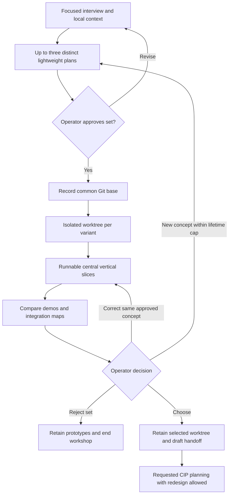

# Approved Design

Operator confirmed the current intent, requirements, risks, and decisions together after selected
planning-review edits. Implementation is deferred; the stash remains intact.

## Components and boundaries

- Independent `workshop` plugin with no runtime review/planning dependency: `skills/ws/SKILL.md`
  carries the short workflow; `assets/worktrees.md` carries host-specific execution and retention.
  CIP availability is checked at handoff rather than installing review dependencies for exploration.
- Interview focuses on outcome/users, concept axis, constraints, and smallest informative demo.
  Reuse existing answers; do not expand into detailed production requirements.
- Alternative brief: sketch/example, benefit/tradeoffs, insertion points/touched paths, lightweight
  steps, peripheral assumptions, minimal demo/check, effort/complexity. Normally offer two or three;
  one is valid if requested or constraints leave no useful alternative, with the reason stated.
- Approve/revise the entire set before creating worktrees or launching implementers. Selection is
  a separate decision after inspectable implementations.
- Default to serial direct execution in isolated Git worktrees; use operator-approved native child
  worktree sessions where the app requires them. Count launches under the existing three-call ceiling;
  no new global architecture exception. No nested delegates, reviews, Judge, dynamic workflow,
  model ladder, or automatic retries. Corrections stay in the same approved concept; a new/replacement
  concept returns to set approval. All distinct concepts count toward a three-concept lifetime cap,
  including rejected/replaced ones; retain their worktrees. After three, refine/select/reject or start
  a new workshop, not a hidden fourth concept.
- Capture one base SHA; app sessions explicitly start from the source branch and verify HEAD before
  edits, terminal worktrees start at the SHA. Dirty starting work requires an operator-approved
  checkpoint or explicit committed-HEAD decision; never silently stash/exclude/copy it.
- Implement a runnable central slice, not an isolated concept stub. Peripheral mocks/fixtures are
  allowed if named. Run only the existing focused build/type/smoke check needed to trust the demo;
  add a small test if no existing check observes it. No broad suite or extra evidence collection.
- Comparison gives each variant's concept/status, branch/path/session/commit, demo command or URL,
  check outcome, shortcuts/gaps, and compact integration map. UI: previews/layouts and distinct
  ports; APIs/components: interface sketches and executable usage. Explain surrounding code on demand.
- Preserve blocked variants visibly; do not silently drop or declare them runnable. Select/revise/
  reject, with approval for replacement concepts. Retain worktrees until explicit cleanup approval.
- Emit a self-contained handoff block containing goal, common base, selected branch/path/session/commit,
  choice rationale, integration map, demo/check commands/outcomes, shortcuts/gaps, and open questions.
  On requested CIP transition, send the block to the selected app session in its planning message,
  or have the operator paste the block with `/cip` in the selected VS Code/CLI worktree context.
  Do not assume forked context or another session inherits the coordinator's conversation/artifacts.
  CIP consumes that explicit block, starts in the chosen worktree, verifies branch/commit, and treats
  the handoff as draft input.
  A mismatch or unavailable CIP is a visible stop. Do not automatically invoke planning or integrate
  into another branch; CIP reconfirms and may redesign.

## Program flow

## Optional call stacks

The flow is sufficient; no executable runtime call stack is added.

## Reuse and distribution

During execution inspect stash commit `33e63ef89f7703f92dbe5d5c4d0dd534293cf657` without applying
it wholesale. Candidate reuse: plugin skeleton, isolation guide, CIP boundary, packaging updates,
and focused checks. The stash predates the operator's clarified integration-map and vertical-slice
requirements and is not design authority. Do not restore generated catalogs; regenerate them.

Use existing plugin manifest conventions and completion order: script sync, registry generation,
marketplace generation, dogfood sync; verify registry, closure/drift, skill size, and selected tests.
No new packages. Update relevant design notes, operator guide, and README without expanding global
architecture-contract scope. Register the plugin and existing consumer-smoke switch arm together.
Update the guide's explicit inventory/link assertions alongside the new page, including the
already-present configuration guide so the inventory reflects actual published pages.

## Host support

| Host | Creation/execution | Inspection |
|---|---|---|
| Copilot app | Native child worktree sessions, explicit source branch, SHA check, bounded kickoffs | Returned app URLs and preview/demo URLs |
| VS Code | Git worktrees; open each in a supported agent/workspace context or explicit direct targeting | Editor/diff, interface examples, demo/preview |
| Terminal CLI | Git worktrees; serial direct tools or worktree-aware sessions | Absolute paths/branches, commands, browser URLs |

No claim of host support from prompt text alone: use small UI/component fixture walkthroughs during
implementation. If a host is unavailable, mark its live check outstanding; request operator verification
rather than treating structural checks as live proof or building an adapter without approval.
