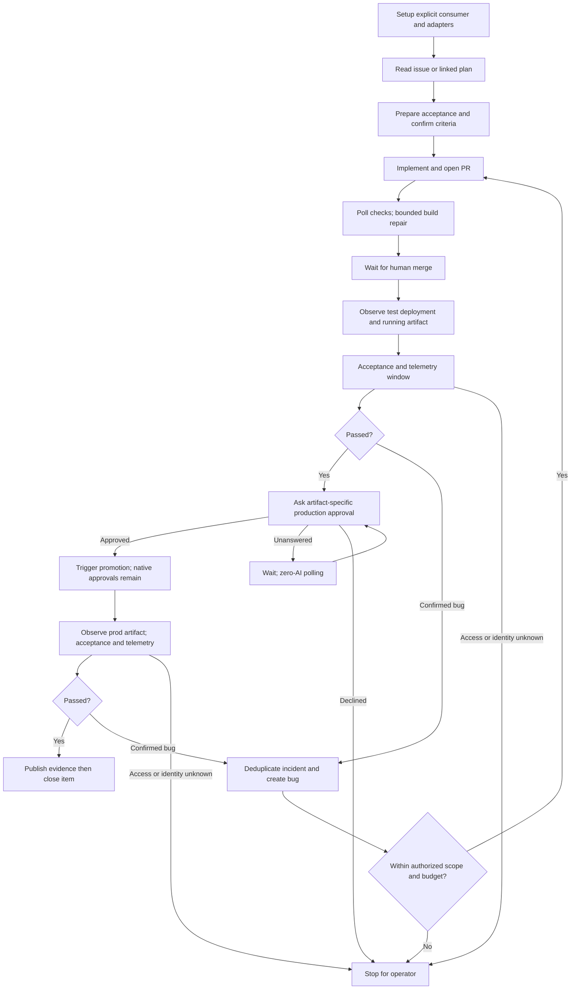

# Design

## Components and boundaries

One plugin with setup, run/resume and demo-control skills; names finalized during implementation.
Prefer plugin-owned PowerShell scripts/modules and installed templates. Add no service or framework.
Reuse existing plan parsing, Git criteria, /cip, /ci, secret screening and distribution tools.

Consumer configuration records command paths, non-secret inputs, environment profiles,
evidence branch, poll/window defaults and operator permissions. Credentials stay in the operator's
authenticated tools/credential store. Setup previews consumer writes, preserves modified content
and tests each command's contract/access before calling a live project ready. Declare first-use
consumer destinations in manifest `scaffolds[]`; prove global assets and local dependency bootstrap
in phase 1 before orchestration depends on them.

Loopback state represents work items, PR checks, approvals and deployments. A small PowerShell
demo application is built into immutable source-derived snapshots; local test/prod profiles
execute acceptance on those snapshots. Demo PR merge performs an actual Git merge. Record PR
source SHA, merge commit and snapshot digest separately; production reuses the test digest without
rebuilding, even after HEAD changes. Real local Git branches/commits exercise evidence and
source preservation. Replay substitutes deterministic implementation for an AI call; agent mode
uses the same chain with real /cip-/ci-directed implementation. Neither mode needs a cloud account.

A finite tick uses one local lock and one atomically replaced checkpoint. A thin watch/scheduler
recipe repeats ticks. Checkpoint stores IDs, stage, expected artifact, approval, incident/call
counters, telemetry cursor/window and evidence publication identity, not raw logs or secrets.
Derive operation keys from already-persisted identity or checkpoint them before dispatch; read
live/simulated provider state before retrying and require the same provider identity. If an
adapter cannot reconcile an unknown result, stop for the operator instead of replaying a write.

Poll scripts return small validated results. No LLM call occurs while waiting. Run commands have
bounded deterministic deadlines; agent elapsed-time policy remains unchanged. Known usage is
recorded through existing ledger conventions and imported into the chain total idempotently by
execution identity, including planning, implementation and every repair. Missing usage blocks
further credit-sensitive admission. Allowance is checked between invocations, not advertised as
a hard spend cap.

## Program flow

All stages reconcile after restart. Initial work uses ordinary /ci phase admission. Corrective
work uses a narrowly opt-in factory repair mode on the existing launcher/agent: resolve the
original plan by identity, run Test-PlanCriteriaBaseline, skip completed-phase Get-PhaseAdmission,
and forbid criteria or planning-confirmed writes. Keep the original plan resolvable, including
its existing archive resolution. Reuse the launcher, not a second Copilot wrapper. Scope changes
return to human confirmation. Setup grants narrow repair authority once; ordinary /ci admission
does not change. Stable build-incident counters survive successor PRs and changed heads: at most
two corrective invocations, independently of the two repair-PR incident limit.

Implement restart proofs incrementally: PR/shared protocol in phase 2, bug/promotion in phase 3,
evidence/closure in phase 4; the final fault matrix combines them.

## Acceptance and incident behavior

Require the deployment source/artifact to map to the merged PR and the observed version to map
to that artifact. A new PR head invalidates previous head-bound checks; a replacement artifact
invalidates acceptance and promotion approval. Superseded deployments are not successful proof.
Production promotes the tested artifact; adapter cannot silently rebuild a different artifact.

Feature scenarios are project-owned, preserve confirmed criteria, specify cleanup and allowed
actions, and execute before the telemetry window passes. Production defaults to read-only checks.
Telemetry queries have explicit environment/time coverage, stable fingerprints and actionable
errors; empty successful queries differ from inaccessible queries. Confirmed bugs become repair
work, suspected/unknown attribution pauses for triage. Authentication outages are prerequisites,
not automatic application bugs. The initiating work item remains open during repair.

## Evidence and completion

Use a separate Git worktree/branch; source references normally replace merges from main.
Record plan, source, artifact, PR/deployment IDs, environment, observed version, scenario results,
window, simulated/live label, verdict and bug links. Pre-publication sanitization excludes secrets
and customer payloads. On blocked publication leave completion pending. Reconcile commit IDs/record
keys after restart; close bugs only after their original reproducer passes on the repair artifact,
and close the original issue after required environment evidence is published.

## Optional call stacks

The Mermaid flow is sufficient. Small command tables and local state are preferable to a general
event bus, adapter inheritance hierarchy, evidence-receipt system or new scheduler.
