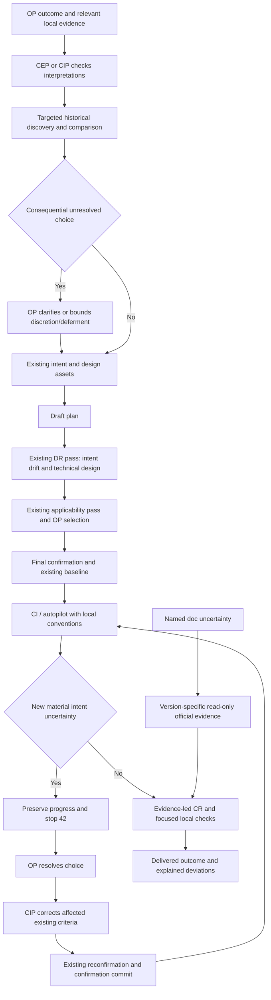

# Approved Design

Lightweight RFC approved by OP on 2026-10-03 after the existing pre-confirmation review and selected corrections. Approval covers current intent, requirements, risks and decisions; implementation and paid evals have not started.

## Components and boundaries

Modify the existing workflow, not its architecture. Instruction changes carry semantic behavior; deterministic scripts carry repository facts and exact selector enforcement.

1. Extend the shared planning protocol from word checks to consequential interpretation checks. Resolve facts locally before asking OP. Show two plausible readings and their practical difference. Reuse existing checkpoints; do not multiply approval prompts.
2. Capture selected original statements with date/source context and OP-confirmed interpretation in the existing five-section intent asset for plans. CEP stores epic-level intent in existing epic.md Goal/Decomposition notes; child CIP inherits only relevant scoped statements with provenance. Put discretion, deferment and historical resolutions in existing sections/assets; do not copy entire chats or add epic assets.
3. Extend current plan-index discovery using existing plan/epic inventory to match relevant active/archived intent. An additive candidate record carries kind, ID, path, archive status, matched section, snippet and missing-context reason. Emit at most three ordinally ordered snippets of 240 characters per artifact, only for the supplied case-insensitive filter; never full intent. Preserve existing requirement/risk/decision records. Read at most three explicitly chosen historical artifacts through existing confinement/secret-screening, extending that reader locally to selected epic intent. Cite conflicts, distinguish stale/different scopes, and record OP-approved supersession. Search limitations and unindexed plans remain visible.
4. Use existing `design.md` as the reviewable RFC: outcome, proposed behavior, boundaries, important flows, tradeoffs and open choices. Requirements/decisions remain linked, not duplicated. At completion report delivered deviations without editing the confirmed baseline.
5. Add alignment to the existing DR pre-confirmation pass, keeping OP statements visible independently of the summary. Existing applicability pass and OP choice remain. Standalone DR uses the same lens where intent exists; absent intent is a stated limitation, not guessed.
6. Teach CI/autopilot to preserve progress and stop with existing operator-action outcome 42 for material unresolved choices; bounded coding choices proceed. After OP resolves the choice, CIP corrects only affected existing criteria, uses current reconfirmation/confirmation-commit handling, and resumes CI after its baseline check. Do not create a new plan, rerun the entire drafting/review protocol by default, add a marker, or weaken baseline protection.
7. Strengthen CR/DR evidence: location, trigger, behavior/contract conflict, impact and supporting trace/test. Check the relevant guard/exception before publishing; valid static evidence is sufficient. Independent selected reviewers see scope and requirements first. No default second review or automatic rerun.
8. Use existing standards and scoped notes for durable local practices, rationale and exceptions. Model knowledge suggests hypotheses; targeted official docs resolve consequential uncertainty about the installed version. Local style wins over generic preference, not over demonstrated failure.
9. External lookup is read-only and bounded to the named question. No private code/secrets in queries, no fetched commands executed, no web-text instruction authority or automatic saved-rule promotion. Missing/version-inapplicable sources remain visible; selected unresolved work is incomplete rather than clean.
10. Reuse Waza `-Plugin`, `-Case`, `-Quick`. Fix case preflight and unrelated adversarial-mode execution locally. Preserve explicit plugin-wide behavior; no new selector framework. Count every retained/revised/new task YAML across the five affected planning/review/execution suites toward 12-20 scenarios total. Map their IDs to required topics in the existing plugin-evals note; revise/replace weak cases before adding more. No uncatalogued tasks; unrelated plugin/global counts stay separate. Include negative controls; semantic rubrics complement cheap structural checks.

## Program flow

## Optional call stacks

No new runtime call stack. Existing index/artifact-reader and confirmation/baseline functions remain owners. Existing Waza argument/mode helpers enforce exact selection. The flow above is sufficient.

## Validation and cost

- Routine checks select named Pester cases/files or affected plugin structural cases. Keep existing deterministic timing contracts; do not run premium evals after every edit.
- A separately approved single-case run selects one functional task and one trial, not a whole adversarial pack. No sub-30-second promise for an LLM run.
- OP may approve a bounded baseline/candidate comparison and one broader final local run if useful. Revisions, cases, actual observations and available spend/latency stay in existing reports; no new cost ledger.
- Count correct findings and known defects missed, false findings, useful clarification versus unnecessary questions, and available cost/latency. No numeric quality-gain guarantee; do not mistake structural checks for empirical performance.

## Historical reconciliation

Relevant prior work: `57cc2c` intent/RFC, `367e9a` simple review workflow, `2aa7ec` local-first baseline. Selected context supports asset reuse, no new interview machinery and focused local operation. Active contracts supersede archived mechanics: old receipts, 2/5 call budgets and 600/1200-word limits are not restored; current zero-default/three-ceiling and 400/800 guidance remain.

The current design does not increase calls or introduce policy/search state. It sharpens the existing meaning of capture, review and escalation. An actual conflict with active criteria/contracts during implementation stops for OP resolution.

## Pre-confirmation review disposition

One required read-only design pass and one applicability pass ran against the complete draft at source `f6c2f5b662038308b9c5d7119ac7feb49bc363be`. All four findings were shown to OP, who selected all recommended edits on 2026-10-03:

- Fix CEP persistence/discovery using existing epic sections/inventory and bounded reader.
- Fix runtime flow using existing stop 42 and affected-plan reconfirmation, not redrafting.
- Fix candidate provenance/snippet bounds in the existing index.
- Simplify suite accounting with one 12-20-task catalog across five existing suites and revision of weak cases.

These are planning decisions, not review receipts or lifecycle state. No reviewer rerun follows these selected edits.

## Dubious decisions

Bounded retrieval cannot prove absence of all historical conflicts. Report consulted scope and missing candidates; expand only for a named unresolved concern with OP authorization. Documentation framing cannot eliminate injection risk, so fetched content remains read-only evidence without privileged actions. Transcript fixtures may test clarification reasoning without reproducing live human interaction; label that fidelity limit.
