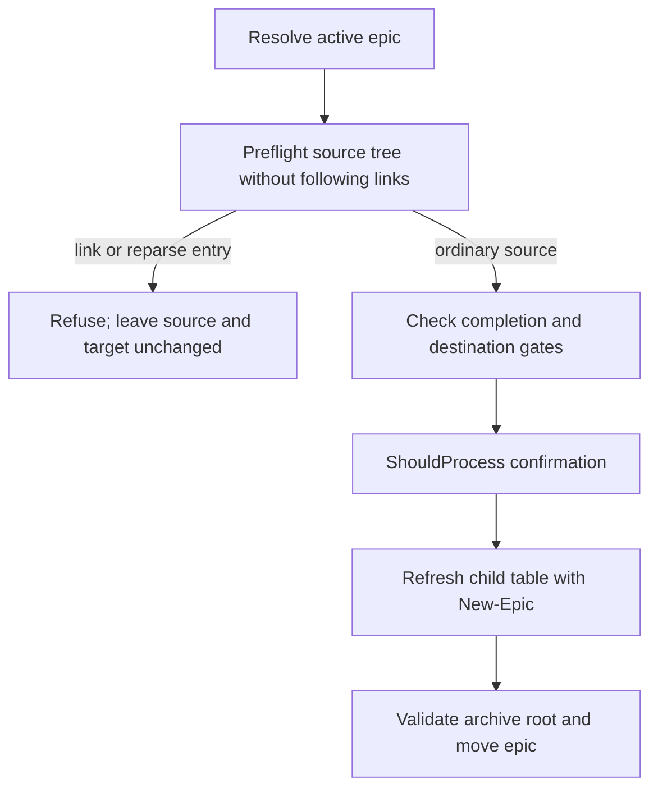

# Approved Design

<!--
Lightweight RFC for operator review: outcome, proposed behavior, boundaries, important flows, tradeoffs, and
open choices. Requirements and decisions remain in their own assets and are linked, not duplicated.
-->

## Outcome and proposed behavior

- Add a direct, bounded preflight to `Archive-Epic.ps1` that checks the resolved epic source folder,
  including `epic.md` and descendants, for links/reparse points before the `ShouldProcess`-approved
  refresh/move sequence.
- Check each entry's attributes before descending. If an entry is a link/reparse point, stop with a
  clear error; do not call `New-Epic.ps1`, rewrite the child table, or move the source.
- Keep the guard local to epic archival and retain `New-Epic.ps1` as the child-table writer.
- `Get-EpicInventory` currently reads `epic.md` while resolving the epic. That preceding read is
  read-only and remains unchanged; this plan prevents a subsequent write through the link.

## Components and boundaries

- `Archive-Epic.ps1`: source-tree safety preflight; existing completion and destination gates;
  confirmation; child-table refresh; archive-root validation; directory move.
- `New-Epic.ps1`: existing generated child-table owner, invoked only after preflight and confirmation.
- `tests/skalary/ArchiveEpic.Tests.ps1`: isolated linked-file and linked-directory regression fixtures.

## Program flow

## Tradeoffs and open choices

- Reuses the existing archive command and child-table writer; no wrapper, generic filesystem service,
  lock, journal, or rollback mechanism.
- The preflight is a point-in-time check. Concurrent local replacement between validation and move is
  not addressed; the repository's trusted single-operator model does not justify a new lock.
- Windows link creation may require privileges. If a required regression fixture cannot be created,
  report the limitation rather than treating the linked-source criterion as verified.

The Mermaid flow is sufficient.
