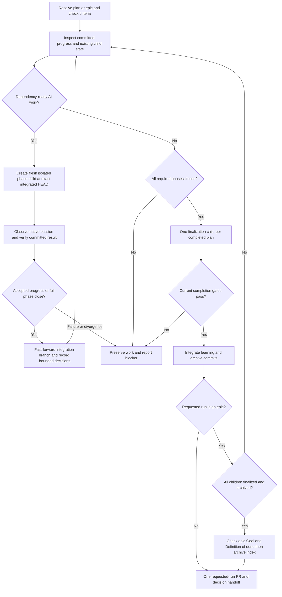

# Design

## Outcome and proposed behavior

One instruction-first app-native `/ci` coordinates standalone and epic work. It reuses deterministic plan/Git primitives instead of adding another execution framework. Requirements and acceptance are in [requirements.md](requirements.md); operator selections are in [decisions.md](decisions.md).

Model aliases keep their public names for compatibility but all bind to GPT-6.1 Sol. The initial effort policy remains Routine medium and Standard/Deep/Independent high. Phase and finalization kickoff explicitly uses high effort/default context. Existing distinct planning-review contexts remain distinct; unavailable Sol stops visibly rather than dispatching a same-model fallback alias.

## Components and boundaries

| Component | Responsibility |
|---|---|
| CI skill and small installed app asset | Coordinator/worker distinction, kickoff contract, native observation, serial integration and decision policy |
| Shared direct executor | Admitted phase work, focused validation, atomic source/checklist commits, explicit blocked outcomes |
| Existing plan helpers | Criteria baseline, dependency/phase admission, committed close and archive state |
| Existing epic helpers | Dependency-ready child selection and local integrated completion; no host launcher |
| Per-plan finalization worker | Current final evidence/review, conditional compaction, learning and plan archival, once for each standalone or epic-child plan |
| Coordinator completion/delivery | Integrate finalization commits, perform the distinct epic completion check/index archival when applicable, preserve explicit push guards, create at most one requested-run PR |
| Model allowlist and owner generators | One model authority and consistent skill/eval bindings |

Avoid custom app extensions, dynamic workflows, generic configuration frameworks, automatic cleanup, extra persisted lifecycle state, and parallel integration branches. Use native tools directly.

## Program flow

### Handoff and resume

Before dispatch, inspect coordinator worktree cleanliness and verify the source branch points to the expected full commit. `base_branch` is explicitly the current integration branch because each new phase depends on accepted in-progress work, not the project default. Child kickoff rechecks its own HEAD and isolation before mutation.

Do not mutate the integration checkout while the child works. The worker produces source/checklist commits on its isolated branch. The coordinator verifies criteria remain unchanged, exact phase scope, current focused evidence, clean committed checklist progress, and ancestry before `git merge --ff-only`. Dirty state, out-of-scope changes, source movement, or divergence stops with visible preserved work.

Idle is only a turn boundary. Read authoritative session activity and phase/commit state; do not duplicate an active worker or invent completion from a message. On resume, reconcile known native child identity with committed source state. If integration already occurred, do not integrate or execute it again. If an earlier child identity is unavailable and work may still be active, require operator reconciliation rather than spawning another writer. Store no new recovery journal; use session context plus Git/Markdown progress.

### Human blockers and decisions

Within the first unfinished phase, run independent admitted AI siblings even if a human step is pending. Later phases require every earlier phase to close, including pending human work; missing explicit dependencies grant no exemption. Independently admitted epic siblings can still proceed. A worker can return committed accepted partial progress without closing the phase. A later visit creates a fresh phase child.

Implementation discretion may choose bounded details and record them in the requested filename. Each entry names the affected step/criterion, decision, rationale, and consequence. Use existing confinement/secret-screening patterns. Write coordinator entries between integrations, never during a worker's source-bound interval. The log is not part of immutable planning criteria and does not authorize new scope.

A material ambiguity preserves affected work and returns to the operator/CIP confirmation flow. Continue only other work whose independent baseline and prerequisites remain valid. Exhaustion reports completed work, blockers and pending human actions, and decisions; it is not whole-plan success.

### Completion and epic delivery

One explicit finalization child follows all closed phases of each standalone or epic-child plan. It owns unchanged-scope terminal review, conditional design-note compaction, learning publication, and plan archive move/commit. Preserve explicit human gates; headless execution skips optional PFB. The coordinator integrates those commits. An all-closed unarchived plan still requires finalization; a finalized archived plan is skipped without requiring a child PR. Do not repeat an unchanged completed boundary.

Epic children each use that complete plan lifecycle and serial phase workers. After all child finalization commits are integrated and all children archived, the coordinator performs one distinct epic Goal/Definition-of-done/coherency check, refreshes the index, and archives/commits the epic index. Pending epic completion still runs on an all-child-archives resume; unchanged completed epic boundaries and existing delivery are not repeated. For new app runs, committed local closure integrated into the requested run's branch replaces the old requirement for a provider PR for every child. Only the final requested run has a delivery PR. Archived legacy plans/epics remain readable without rewriting their historical proof or relaunching them.

### Runtime and distribution retirement

Move reusable executor, compaction and helper payload ownership into continue-implementation. Remove its autopilot dependency and retire the standalone autopilot plugin through existing published retirement metadata. Do not transfer paths in a way that lets CI update overwrite another installed plugin's receipt-owned payload.

Remove active CLI host/container/Sandbox launchers, runtime config schemas/templates, auth/offline/container machinery used only by that runtime, and their obsolete tests. Migrate or explicitly refuse active consumers of removed entrypoints. Old local configs, credential stores, receipts, and archived ledgers are user/history artifacts: do not delete them automatically.

Remove the old runtime menu from CI and its config catalog route; document old execution markers/configuration as obsolete rather than pretending they select a supported runtime. Preserve unrelated CLI package/eval surfaces. Exact CLI-sidecar credit recording is not carried forward as fictional app accounting; historical ledgers remain readable.

Run the owning model, script-bundle, registry, marketplace, and dogfood generators; do not hand-edit generated copies. Update active direct-workflow architecture, execution/plan/customization/config notes, operator guides, and README/instructions when structure changes.

## Tradeoffs and open choices

- One model reduces configured model diversity; independent contexts remain useful but cannot be called cross-model corroboration.
- Retaining current role efforts avoids changing model and effort behavior simultaneously. Later effort tuning stays in the same policy; no second model-config file is introduced.
- Serial fast-forward integration is simpler than phase PR orchestration, but phase acceptance is local; final GitHub review remains the delivery boundary.
- Preserving earlier-phase closure limits unattended progress when a human step blocks that phase, even if later work appears independent. Ready AI siblings in the current phase and independently admitted epic siblings still proceed; no cross-phase exemption is added.
- No recovery journal means ambiguous lost-session ownership stops for the operator rather than risking a duplicate writer.
- Native-tool prompt contract tests are necessary but insufficient. The final explicit live app smoke is a human gate.
- No remaining intent choice is delegated silently. Newly discovered material choices use the existing confirmation flow.

## Optional call stacks

The flow above is sufficient; no additional runtime layer is proposed.
