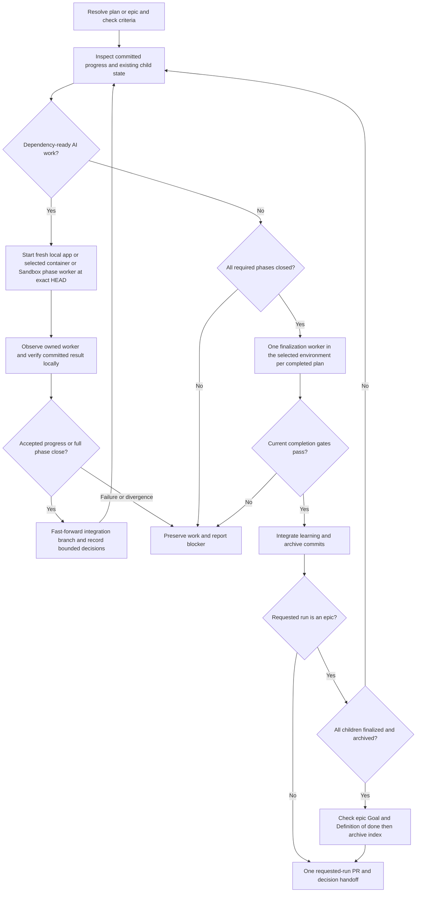

# Design

## Outcome and proposed behavior

One instruction-first `/ci` coordinator policy works in the Copilot app and modern VS Code Copilot. It selects local native sessions through the current client's verified tools or retained container/Windows Sandbox CLI workers. The operator uses the chosen client, not a manual CLI workflow; isolated CLI processes remain an internal runtime. Reuse deterministic plan/Git primitives and launchers, not another framework. Requirements and acceptance are in [requirements.md](requirements.md); selections are in [decisions.md](decisions.md).

Model aliases keep their public names for compatibility but all bind to GPT-6.1 Sol. The initial effort policy remains Routine medium and Standard/Deep/Independent high. Phase and finalization kickoff explicitly uses high effort/default context. Existing distinct planning-review contexts remain distinct; unavailable Sol stops visibly rather than dispatching a same-model fallback alias.

## Components and boundaries

| Component | Responsibility |
|---|---|
| CI skill and small installed app/VS Code assets | Shared coordinator/worker policy, verified client-specific native session route, explicit environment selection, settings, observation and integration |
| Shared direct executor | Admitted phase work, focused validation, atomic source/checklist commits, explicit blocked outcomes |
| Local worker | Fresh full native session in an isolated worktree, created/observed by the current client's verified tools, replacing in-context and standalone host orchestration |
| Retained isolated runtime | Docker or Windows Sandbox CLI phase/completion invocation with existing auth, toolchain, offline/rebundle, output and usage handling |
| Existing plan helpers | Criteria baseline, dependency/phase admission, committed close and archive state |
| Existing epic helpers | Dependency-ready child selection and local integrated completion; no host launcher |
| Per-plan finalization worker | Current final evidence/review, conditional compaction, learning and plan archival, once for each standalone or epic-child plan |
| Coordinator completion/delivery | Integrate finalization commits, perform the distinct epic completion check/index archival when applicable, preserve explicit push guards, create at most one requested-run PR |
| Model allowlist and owner generators | One model authority and consistent skill/eval bindings |

Avoid custom app extensions, dynamic workflows, generic configuration frameworks, automatic cleanup, extra persisted lifecycle state, and parallel integration branches. Use native tools for local sessions and existing controlled launchers/transfers for explicitly selected isolated workers. Do not claim those workers are native app child sessions. App local process sandboxing and cloud sandboxes are not replacements for these Docker/Windows Sandbox environments.

## Program flow

### Client capability boundary

The modern Copilot SDK-backed harness is shared across VS Code/CLI/app; tool inventories and lifecycle interfaces need not be. Support modern VS Code's Copilot Agent Host target explicitly, not its legacy Local extension-host harness. Keep shared authority in the installed CI skill, with small app/VS Code instruction routes; `.github/github-app.yml` is app-only supplemental guidance.

Before removing local execution routes, establish the actual automatic full-session creation, isolated worktree, exact model/effort/context, live observation and result handoff available in each client. Record supported target/version and capability evidence. App `create_session`/messaging are not assumed to exist in VS Code. A UI new-session command or same-context subagent alone does not prove the requested unattended phase orchestration. If the native client route is absent, stop for an operator decision before deleting that route; do not add a framework or silently revive in-context/standalone-host fallback.

### Handoff and resume

Before dispatch, inspect coordinator cleanliness and source branch/full commit. App children bind `base_branch` to the integration branch; VS Code's verified equivalent must establish the same exact start/worktree, never infer a project-default base. Isolated workers bind that source commit through retained preparation. Each worker rechecks HEAD/isolation before mutation. All clients/environments use Sol high/default and a fresh phase-visit context; isolated launchers must not start a competing whole-plan loop.

Do not mutate the integration checkout while the worker runs. The worker produces source/checklist commits on its isolated branch. Container/Sandbox outputs return via existing controlled Git/artifact transfer; preserve commit ancestry and verify exact commits locally before acceptance. Retain explicit transport-push permissions, but workers do not create phase/child PRs. Do not transport credentials or broad mapped host state. The coordinator verifies criteria remain unchanged, exact phase scope, current focused evidence, clean committed checklist progress, and ancestry before `git merge --ff-only`. Dirty state, out-of-scope changes, missing/corrupt transport, source movement, or divergence stops with recoverable work.

Idle is only a native turn boundary. Read authoritative native session activity or the isolated worker's owned process/container state and launcher outcome, plus phase/commit state. Transcripts, sentinels and exit markers alone do not establish committed acceptance. Keep completed, blocked/operator-action 42, offline-rebundle 43 and other failures distinct. A runtime exit 42 with committed partial work is not automatically acceptance or permission to continue: inspect its named blocker and revalidate unaffected work. Do not duplicate an active worker. On resume, reconcile known native child or runtime identity with committed source state. If integration already occurred, do not integrate or execute it again. Ambiguous active ownership requires operator reconciliation rather than another writer. Use native session context and existing launcher/output/Git state, not a new recovery journal. Keep exact isolated usage sidecar import idempotent, including archive-path re-resolution.

### Human blockers and decisions

Within the first unfinished phase, run independent admitted AI siblings even if a human step is pending. Later phases require every earlier phase to close, including pending human work; missing explicit dependencies grant no exemption. Independently admitted epic siblings can still proceed. Apply this shared policy to all three environments. A worker can return committed accepted partial progress without closing the phase. A later visit creates a fresh native child or isolated CLI invocation.

Implementation discretion may choose bounded details and record them in the requested filename. Each entry names the affected step/criterion, decision, rationale, and consequence. Use existing confinement/secret-screening patterns. Write coordinator entries between integrations, never during a worker's source-bound interval. The log is not part of immutable planning criteria and does not authorize new scope.

A material ambiguity preserves affected work and returns to the operator/CIP confirmation flow. Continue only other work whose independent baseline and prerequisites remain valid. Exhaustion reports completed work, blockers and pending human actions, and decisions; it is not whole-plan success.

### Completion and epic delivery

One explicit finalization worker in the selected environment follows all closed phases of each standalone or epic-child plan: a native child locally or fresh CLI completion invocation inside the container/Sandbox. It owns unchanged-scope terminal review, conditional design-note compaction, learning publication, and plan archive move/commit. Preserve explicit human gates; headless execution skips optional PFB. The coordinator verifies/imports and integrates those commits and owns the only final PR. Retain exact CLI usage recording for isolated targets; do not fabricate local app usage. An all-closed unarchived plan still requires finalization; a finalized archived plan is skipped without requiring a child PR. Do not repeat an unchanged completed boundary.

Epic children each use that complete plan lifecycle and serial phase workers. After all child finalization commits are integrated and all children archived, the coordinator performs one distinct epic Goal/Definition-of-done/coherency check, refreshes the index, and archives/commits the epic index. Pending epic completion still runs on an all-child-archives resume; unchanged completed epic boundaries and existing delivery are not repeated. For new app runs, committed local closure integrated into the requested run's branch replaces the old requirement for a provider PR for every child. Only the final requested run has a delivery PR. Archived legacy plans/epics remain readable without rewriting their historical proof or relaunching them.

### Retained runtimes and local orchestration replacement

Continue-implementation owns shared app/VS Code coordinator policy; keep autopilot and its dependency for shared executor, compaction/helpers and isolated runtime payloads. Keep one payload owner rather than duplicate executors or needless receipt transfer. This supersedes the prior blanket retirement. Verify both clients' replacement local routes and migrate callers before removing old local orchestration.

Preserve container and Windows Sandbox launchers, runtime config schemas/templates, authentication, toolchains, offline feeds/rebundling, exit/output contracts, usage sidecar normalization and their tests. Replace only the standalone local host/epic orchestration loop after migrating live consumers, including factory repair without removing its bounds. Do not retire the whole plugin or remove required assets merely because local host execution becomes native. Old configs, credential stores, receipts and archived ledgers remain untouched except explicit owner-controlled configuration migration.

CI selects the current client's native local sessions, container or Windows Sandbox explicitly. Retain the isolated config/catalog and valid container/Sandbox markers. Map old host selection to that client's native route clearly; no isolation downgrade or unavailable-native CLI fallback. Unrelated CLI package/eval tooling remains. Exact isolated CLI usage is retained; local app/VS Code usage is not inferred or fabricated.

Run the owning model, script-bundle, registry, marketplace, and dogfood generators; do not hand-edit generated copies. Update active direct-workflow architecture, execution/plan/customization/config notes, operator guides, and README/instructions when structure changes.

## Tradeoffs and open choices

- One model reduces configured model diversity; independent contexts remain useful but cannot be called cross-model corroboration.
- Retaining current role efforts avoids changing model and effort behavior simultaneously. Later effort tuning stays in the same policy; no second model-config file is introduced.
- Serial fast-forward integration is simpler than phase PR orchestration, but phase acceptance is local; final GitHub review remains the delivery boundary.
- Preserving earlier-phase closure limits unattended progress when a human step blocks that phase, even if later work appears independent. Ready AI siblings in the current phase and independently admitted epic siblings still proceed; no cross-phase exemption is added.
- No recovery journal means ambiguous lost-session ownership stops for the operator rather than risking a duplicate writer.
- The operator works in the selected app/VS Code client, but isolated workers remain CLI processes rather than native child sessions. Native remote/container/Sandbox attachment is not promised or required.
- Modern VS Code support is required, but shared harness is not capability proof. Small client-specific routes and a separate live gate expose unsupported session APIs without creating a compatibility framework or silent local fallback.
- Preserving environments keeps their launch/auth/offline mechanisms, not competing plan coordinators. One coordinator owns admission and integration; launchers execute bounded targets.
- Native-tool/launcher contract tests are necessary but insufficient. Explicit live local, container and Windows Sandbox smokes are human gates.
- No remaining intent choice is delegated silently. Newly discovered material choices use the existing confirmation flow.

## Optional call stacks

The flow above is sufficient; no additional runtime layer is proposed.
