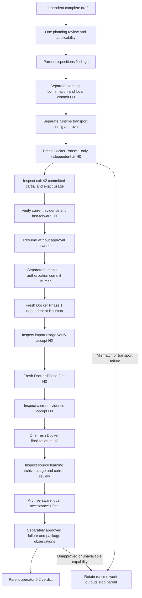

# Docker acceptance design

## Outcome and proposed behavior

Independent draft 1a4feb implements only the guide's three-file human-safe workload. The app owns serial bounded Docker launch, observation and local acceptance. Requirements are in [requirements.md](requirements.md), boundaries in [intent.md](intent.md), and concrete stops in [risks.md](risks.md).

This is a preparation proposal, not a record of passing live acceptance. Parent/operator dispositions the one planning review, confirms the resulting draft, then separately authorizes runtime/transport/config/feed actions. Human 1.1 and final parent 6.2 acceptance remain separate.

## Components and boundaries

| Surface | Exact proposal or observed state |
|---------|----------------------------------|
| Initial implementation HEAD | Observed clean `1e0be7cac04e0212406a7325929859bd27d9a2ba` before mutation |
| Coordinator | App session `cd67998b-3b75-4933-a7ac-51c2500f4604`; source branch `jiri-san-docker-ci-acceptance` |
| Main plan | `standalone-2026-10-10-1a4feb-app-ci-smoke-docker`; four unchecked S steps; no expected packages |
| Transport checkout | Proposed new owned checkout `C:\Users\jiri\.copilot\session-state\b9ab0f2f-be39-4fde-b350-a8064c5876f0\files\docker-1a4feb-transport`, at future confirmed H0; no sibling checkout/config reuse or shared Git exclusion changes |
| Actual config | Tracked `.autopilot.json`; runtime container, Copilot pat, GitHub pat-shared, saved primary-model-mid/medium/default, maxIterationsPerStep 10, build `npm run build`, test `npm test` |
| Main config proposal | Retain entire tracked config byte-for-byte and saved medium effort; installed app mode overrides to Sol/high/default in memory. Offline absent/disabled by default; no config application |
| Config previews | Source digest `262bb221418cfce52675c2f9fe92c11b0fc26a0018faa2734977d9760630c2fe`; separate high/default/offline-disabled and npm/offline-enabled/maxRebundles 1 previews made; no application |
| Runtime | Real Docker desktop-linux; parent read-only preflight reports Engine 29.8.2, Desktop 4.94.0, Windows 11 Pro build 26300; re-observe at authorized launch |
| CLI | Actual version from built image and each invocation, not inferred from host; launcher probes latest npm CLI, so capture resolved build arg and image ID |
| Auth | Existing target name `copilot-autopilot`; parent reports availability validated. Do not fetch/log/copy tokens during preparation |
| Output | Actual launcher-owned `%TEMP%\autopilot-usage-<generated-id>` with raw sidecars/transcripts, and retained unique container. No output/usage creation yet |

Parent corrected the ignored-config premise on 2026-10-10. Main transport retains the tracked `.autopilot.json` and saved medium effort unchanged; installed app-mode overrides are in memory. No config application/restoration or hidden assume-unchanged/skip-worktree state is proposed. Existing required-field `git` identity comes from confirmed source, not copied host config. Separate package companion configuration requires its own approval.

Proposed main refs (all remote publication pending approval):

| Visit | Mode/phase | Source expected HEAD | Work ref |
|-------|------------|----------------------|----------|
| First independent | app-phase / 1 | H0 after own confirmation | `smoke-docker-1a4feb-p1-independent` |
| No-human resume | no launch | accepted H1 | none |
| Authorized dependent | app-phase / 1 | Hhuman | `smoke-docker-1a4feb-p1-dependent` |
| Phase 2 | app-phase / 2 | accepted H2 | `smoke-docker-1a4feb-p2-second` |
| Finalization | app-finalization | accepted H3 | `smoke-docker-1a4feb-finalization` |

Do not publish current preparation/draft HEAD as H0. After planning confirmation, report its actual full commit and source/work refs to the parent for operational approval. Before each later publication bind the newly accepted full source head. Work refs must be absent/fresh; a failed known invocation is inspected, not replaced by an ambiguous new writer.

Proposed main preparation commands after operational approval: `git worktree add --detach <exact-transport-path> <full-H0>` from this source; inspect clean HEAD and exact tracked config there; publish only `git push origin HEAD:refs/heads/jiri-san-docker-ci-acceptance` from the exact approved source HEAD. Origin is observed `git@github.com:jIRI-san/skalary.git` and runtime converts it to HTTPS for existing auth. Refs in this table require GitHub publication permission; fixture selection alone is not permission. No remote lookup/push or transport checkout creation has run.

## Program flow



## Concrete invocation and acceptance

The app invokes the installed launcher directly from the owned transport root, only after explicit approval. Example first target, with H0 replaced by the approved full commit:

```powershell
.\.github\skills\autopilot\scripts\launch.ps1 `
  -PlanSlug standalone-2026-10-10-1a4feb-app-ci-smoke-docker `
  -Mode app-phase -Phase 1 -Runtime container `
  -Branch jiri-san-docker-ci-acceptance `
  -ExpectedStartCommit <approved-full-H0> `
  -WorkerBranch smoke-docker-1a4feb-p1-independent
```

Later calls use the table's exact current source HEAD and unique work ref. Finalization uses `-Mode app-finalization` without `-Phase`. No legacy next-phase/whole-plan loop and no manual operator CLI phase run. Capture launched process identity and named container immediately; observe actual installed CLI flags `--model gpt-6.1-sol --context default --effort high --agent autopilot --no-ask-user`, fresh `--session-id`, exact `--usage-output-file` and share path, expected full worker HEAD, original ancestry, and target mode/phase. Missing observability is a capability failure.

Before every mutation/dispatch recheck this fixture's own confirmed baseline and current readiness through installed helpers. First phase admits only 1.2. After its exit 42 inspect atomic source/checklist/decision commit and all unchecked/absent downstream state. Raw exit alone is not accepted progress.

Fetch only the approved known work ref into transport. Check out the inspected exact full result HEAD before importing its raw sidecars. The target argument is the real sidecar basename suffix (installed `phase-1`, `phase-2`, or `completion-only`), not invented per-visit labels; session start time distinguishes fresh visits. Retain all raw outputs.

```powershell
.\.github\skills\autopilot\scripts\Record-AiCreditUsage.ps1 `
  -PlanFolder <resolved-active-or-archive-plan-folder> `
  -UsagePath <exact-retained-sidecar> -Target <actual-target> `
  -Runtime container -ModelAlias primary-model-high -ContextTier default
```

Inspect actual model metrics/settings and integer totalNanoAiu. Commit only that exact ledger, repeat identical import, and prove equal execution count, integer total, and ledger bytes. Check clean transport/integration, original ancestry and unchanged integration HEAD via installed `Test-AppCiWorkerResult.ps1`. That helper is mechanical: separately inspect full allowed-scope diff, criteria/checklist deltas, actual output bytes and active current evidence/review. Import verified full result plus ledger into source by local Git fetch from transport, then `git merge --ff-only <full-head>` only after all checks pass.

Capture H1 and independent blob. Resume without human approval: no new container/CLI invocation or finalization, same HEAD/checklist and blocker. Human permission marks only 1.1 in a separate commit Hhuman. Fresh Phase 1 at Hhuman admits 1.3 without rewriting 1.2; fresh Phase 2 at accepted H2 admits 2.1 with both earlier blobs unchanged.

For byte evidence use this direct PowerShell assertion, substituting exactly one table row per result ID; no new harness/file is needed:

```powershell
$path = 'smoke\app-ci\1a4feb\independent.txt'
$expected = [Text.Encoding]::ASCII.GetBytes("independent`n")
$actual = [IO.File]::ReadAllBytes((Join-Path (Get-Location) $path))
if ([Convert]::ToHexString($actual) -cne [Convert]::ToHexString($expected)) {
    throw "Exact fixture bytes differ: $path"
}
```

| Typed result | Path/text | Expected length / hex |
|--------------|-----------|-----------------------|
| `test:docker-independent-bytes` | independent.txt / independent | 12 / `696E646570656E64656E740A` |
| `test:docker-dependent-bytes` | dependent.txt / dependent | 10 / `646570656E64656E740A` |
| `test:docker-second-bytes` | second.txt / second | 7 / `7365636F6E640A` |

Run the actual bytes at the inspected worker head and again locally before integration. Supply current result objects to existing `Invoke-DirectEvidence`; these identifiers are not claims that an installed test already ran. Use current `review:cr` for final evidence only from an active completed exact-scope review; advisory historical reports cannot satisfy it.

After H3, one fresh finalization owns current whole-plan evidence/review, strict learning commit immediately after completed active source, then a separate archive commit. No design-note changes means no compaction. Check exact source/learning/archive order and re-resolution by ID, then archive-aware sidecar import and ledger-only commit before local acceptance. Repeat archived resume: no worker, repeated finalization, active-folder recreation, duplicated integration/usage, or PR. No publication permission exists; stop before PR.

## Live evidence matrix - pending observations

Record these in the acceptance conversation with actual heads, owned process/container/output identities, commands/results and authorization provenance. The markers identify real current observations after execution; none is passing now. This matrix belongs to parent 6.2 acceptance, not worker self-certification or extra checklist steps.

| Typed marker | Required observation |
|--------------|----------------------|
| `test:docker-target-binding` | Each fresh named container, actual CLI/image/runtime versions, Sol/high/default flags, one app target, exact current worker HEAD and original ancestry; no recursive/legacy loop |
| `test:docker-human-admission` | Independent partial, unchecked human/dependent/second state, no-approval resume dispatch count zero, separate human commit, later fresh dependency-ready visits |
| `test:docker-local-acceptance` | Current scope/criteria/byte evidence and mechanical helper at every exact head; clean transport/source; fast-forward only after acceptance; source frozen during interval |
| `test:docker-output-usage` | External exact transcripts/sidecars survive; verified checkout precedes ledger import; identical import preserves count/integer credits/bytes; final usage resolves archived plan |
| `test:docker-finalization-once` | One completion invocation, current whole-plan review, immediately ordered source/learning then archive commits, archive ID resolution and no repetition on resume |
| `test:docker-publication-recovery` | Approved controlled work-ref publication denial, non-success, retained named container/commits/dirty files/sidecars, unchanged source, inspected recovery before separately authorized retry |
| `test:docker-offline-rebundle` | Package-bearing approved companion: real missing-package 43, preserved manifest/work ref, one host rebuild/lock commit and retry at actual NEW work HEAD with original ancestry |
| `test:docker-rebundle-cap` | Approved second miss on retry with maxRebundles 1; final 43 and no third invocation/rebuild; preserved outputs, never success |
| `test:docker-stale-session-preservation` | Capture pre-existing shared session directory names and non-secret metadata read-only; app launcher reports sweep skipped; compare unchanged old directories after each visit, no artificial shared sentinel |
| `test:docker-publication-boundary` | Only approved named source/work refs published; no worker PR. Stop before final PR until exact head/base separately authorized; inspect existing exact-run PR on future resume |

## Controlled failure proposal - separate approval required

Use a separate fixture-owned probe work ref `smoke-docker-1a4feb-publication-failure`, a fresh independent workload source copied only from independently confirmed fixture criteria, and a separately approved disposable transport boundary. Do not run this against an already completed 1a4feb step or change confirmed criteria to manufacture dirty work.

Preferred action set: a parent-approved branch-specific push rejection for exactly this work ref while source clone/fetch remain permitted, installed at a fixture-owned transport endpoint. Save its pre-change state; do not alter GitHub shared branch policy or shared credentials. The existing launcher consumes origin for clone/push, so a host-only pushurl override does NOT prove container publication failure. A local filesystem bare remote is not reachable inside the unmodified Docker route; do not claim otherwise.

After approved rejection and runtime exit, inspect the retained named container's work ref/HEAD, tracked dirty diff, ordinary non-ignored untracked files if actually present, and raw transcripts/sidecars. Do not force dirty work by new worker criteria; absence of dirty work cannot prove dirty preservation. Verify source integration did not advance. Recovery is read-only inspection/export of actual commits/patch/untracked content from that named container into retained fixture output; no staging, acceptance, publication, or container removal. Re-enable only that fixture ref and retry only after parent approves recovery/head/ref.

Capability gap: no approved container-reachable disposable rejecting endpoint exists yet, and a controlled dirty-failure trigger is not part of the fixed three-file workload. Parent must name/approve these precise actions, or leave publication/dirty recovery evidence incomplete. No new server/harness or repository-policy mutation is proposed by default.

## Package-bearing rebundle proposal - separate approval required

Installed `prepare-packages.ps1` consumes root npm manifest/lock; initial restore copies only these into a temporary directory, and rebundle restores at a temporary checkout root. Skalary has no dependency and no package lock here. Nested `smoke/app-ci/1a4feb/package.json` cannot exercise its real npm path. Do not enable npm offline preparation for the main fixture or add a root Skalary dependency.

Proposed companion: a separate disposable repository at `C:\Users\jiri\.copilot\session-state\b9ab0f2f-be39-4fde-b350-a8064c5876f0\files\docker-1a4feb-package-fixture`, populated only from named fixture-authored package inputs and installed runtime/CIP/CI/config payload at preparation commit. Its own implementation inputs live in its `smoke\app-ci\<fresh-companion-id>` subtree; root package.json/package-lock.json are the explicitly approved disposable-repository feed inputs, not Skalary inputs. No arbitrary host/main/sibling files or shared Git exclusions. Its independently created `/cip` plan, confirmation commit and refs require parent review/approval before launch. This is not confirmation inherited from 1a4feb/native fixture.

Proposed root manifest is private, with initial dependency `is-number` 7.0.0; its current public registry bytes/integrity and generated lock require authorized host download, never invented lock metadata. Initial feed includes only that dependency. An admitted companion step changes its confined root manifest to add `is-odd` 3.0.1, which is absent from initial feed, and commits a real rebundle request under existing executor policy. For cap proof only, separately approved retry work adds `is-even` 1.0.0 absent from the rebuilt feed. Record versions/integrities/absence observations and original/new full heads. No package code runs during host restore (`--ignore-scripts` in existing helper).

Proposed companion source/work refs: `smoke-docker-1a4feb-packages-source`, `smoke-docker-1a4feb-packages-rebundle`, and separate `smoke-docker-1a4feb-packages-cap`; remote repository/endpoint and full commits are not yet established. Config: container/pat/github/pat-shared, Sol/high/default app target, `offlinePackages.enabled=true`, `ecosystems=["npm"]`, `maxRebundles=1`; build/test use companion-owned allowed `npm run`/`npm test` byte/package assertions, not Skalary tooling.

Exact proposed companion file set: root `package.json`, generated `package-lock.json`, `.gitignore` ignoring node_modules/feed/output/local `.autopilot.json`; installed `.github\skills\{cip,ci,autopilot,skalary-config}` payload and their declared installed dependencies; fresh script-scaffolded plan/assets; fixture-only `smoke\app-ci\<companion-id>\package.test.cjs` using Node's built-in assertions/test runner, and the exact text outputs if its independently confirmed intent uses them. Do not copy tracked Skalary config; bootstrap from the installed example and preview only named local values. Payload dependency closure must be observed and pinned before companion approval; an incomplete copied payload stops, not installation/download by default.

Proposed commands, run directly from that companion root only after separate approval:

```powershell
git init
# Set only the approved disposable origin; URL remains an operator-owned capability gap.
git remote add origin <approved-disposable-repository-url>
.\.github\skills\cip\scripts\New-Plan.ps1 -Title 'Docker package rebundle acceptance' -Slug app-ci-smoke-docker-packages -RepoRoot .
.\.github\skills\skalary-config\scripts\Set-SkalaryConfig.ps1 -Action bootstrap -Category autopilot -RepoRoot .
# Review bootstrap digest, then separately authorize exact apply and named values.
npm install --package-lock-only --ignore-scripts --no-audit --no-fund
.\.github\skills\autopilot\scripts\prepare-packages.ps1 -RepoRoot . -Ecosystems npm
# Main launch automatically prepares feed; this explicit preparation may be omitted to avoid duplication.
.\.github\skills\autopilot\scripts\launch.ps1 -PlanSlug <independently-confirmed-folder> -Mode app-phase -Phase 1 -Runtime container -Branch smoke-docker-1a4feb-packages-source -ExpectedStartCommit <approved-full-companion-H0> -WorkerBranch smoke-docker-1a4feb-packages-rebundle
```

The bootstrap command above is preview-only in this installed config owner. No apply digest or confirmation commit is invented here. Exact apply parameters/digest and full source commit are a later gate, after companion files and independent confirmation exist.

Download/publication effects to approve: public npm metadata/tarballs for is-number/is-odd/is-even and their generated lock's actual transitive closure; default feed population; Docker base/toolchain and resolved Copilot CLI npm downloads on each image build; exact source/work-ref pushes and host lockfile pushes on the approved disposable origin. Capture registry URLs, integrity and downloaded closure before acceptance; refuse an unapproved dependency/feed credential source. Preserve companion repository/commits, feed paths, manifest/lock diffs, named containers, external exact sidecars/transcripts and actual retry heads. No Skalary dependency, lockfile or config changes.

Existing launcher uses default `%LOCALAPPDATA%\autopilot-package-feed\<repository-leaf>\<sanitized-branch>\{npm,nuget}` and has no FeedRoot config forwarding. Approve only exact companion leaf/ref feed paths, read-only `/feed` mount and runtime-local writable npm cache. Rebundle changes work-ref feed path; capture actual paths before retry and never clear shared caches. Fresh unique companion leaf/ref names prevent reuse of unrelated feed data; stop if they exist.

Action sequence after independent approval: generate/commit companion manifest+real lock; prepare initial feed; launch one app phase; observe genuine offline miss and committed manifest/ref publication with 43; allow at most one installed host unlocked restore/lock commit/push and image rebuild; inspect actual retry HEAD plus original ancestry; run actual offline package evidence. Separately exercise cap with the second approved miss: preserve final 43 and refuse a third attempt. Do not conflate intermediate 43 with launch.ps1's final exit after automatic retry.

Existing helpers remove their own temporary restore/rebundle checkout. Parent must explicitly approve that bounded helper-owned cleanup exception before this package path; no persistent fixture work surfaces are deleted. If any package mechanism/endpoint/authorization cannot be established, report capability gap; static dispatch tests cannot pass this observation.

## Tradeoffs and open choices

- Direct Markdown protocol and existing tools avoid another smoke harness. Actual evidence remains a live operator obligation.
- One exact confirmed four-step main fixture is small, but package/root-feed and rejecting-endpoint observations require separately scoped approved probes. They cannot be silently added to worker scope.
- Tracked source config makes ignored-only setup unavailable in this checkout. Parent-directed correction keeps main config unchanged and uses existing in-memory overrides, avoiding extra config machinery.
- Preserve every persistent fixture commit/worktree/container/output. No source parent changes, runtime, downloads, config application, controlled failure or remote action before the parent gate.

## Optional call stacks

Mermaid plus the exact installed command examples is sufficient; no additional execution machinery.
