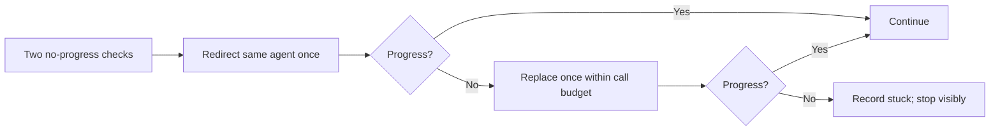

# Implementing with `/ci`

`/ci` resolves a confirmed plan, chooses interactive or autonomous execution, and closes work from
current evidence. The executable contract is the [`/ci` skill](../../plugins/continue-implementation/skills/ci/SKILL.md).

## Mode and runtime selection

`/ci` presents the active mode choices and recommends the plan header's
`execution-mode: manual | host-autopilot | container-autopilot | sandbox-autopilot` default:

| Mode | Where it runs | Approval behavior |
|---|---|---|
| Interactive (approve each step) | Current session/worktree | Pauses before each step; normal choice for `manual` or no marker |
| Autopilot (autoapprove) | Current session/worktree | Executes in-session without per-step approval |
| Host autopilot | Blocking launcher with a host Git worktree | Headless autonomous run; optional trusted host-command override |
| Container autopilot | Blocking launcher in Docker, clone-from-remote | Headless isolated run; optional offline package feed |
| Sandbox autopilot | Blocking launcher in disposable Windows Sandbox | Headless isolated Windows run; optional offline package feed |

The plan's `scope: step | phase | plan` is a default, not proof of completed work. For Host,
Container, or Sandbox, `/ci` asks **One phase** or **Whole plan**: `step`/`phase` recommends One phase,
`plan` recommends Whole plan, and missing/invalid scope does not infer Whole plan. These map to the
launcher's `next-phase` and `whole-plan` values. In-session modes follow the admitted step/phase
selection directly.

When already inside an autopilot container (`AUTOPILOT_CONTAINER=true`), nested autonomous and
in-session autoapprove choices are suppressed and work executes in place. When
`AUTOPILOT_DISABLE_HOST=true`, Host autopilot is unavailable; the launcher independently enforces that
boundary. See the active [plan template](../../plugins/create-implementation-plan/skills/cip/assets/plan-template.md)
and [launcher](../../plugins/autopilot/scripts/launch.ps1).

Autonomous mode validates or creates host-local `.autopilot.json`, accepts an optional trusted
`.autopilot.host.json` command override, and invokes
[`launch.ps1`](../../plugins/autopilot/scripts/launch.ps1). The
[configuration schema](../../plugins/autopilot/schemas/autopilot.schema.json) covers auth, Git provider,
model/context/effort, build/test commands, and optional offline packages. Runtime isolation, branch,
auth, explicit push/staging, and offline rebundle behavior remain launcher responsibilities.

## Admission and criteria baseline

1. Resolve one active plan (or the selected child of an epic) and its dependency state.
2. Run the focused plan parser/validator. A plan that is missing, ambiguous, structurally invalid,
   dependency-blocked, or not confirmed is not admitted.
3. Before **any** checklist, branch, worktree, log, or source mutation, run
   `Test-PlanCriteriaBaseline`.
4. It finds the unique Git commit that introduced the current confirmation marker and compares
   `intent.md`, `requirements.md`, `risks.md`, and `decisions.md` through Git clean filters.

Missing, uncommitted, ambiguous, or drifted criteria are refused and returned to `/cip`. Checklist,
stage, and worktree markers in `plan.md` remain mutable so work can resume.

## Execution flow

```mermaid
flowchart TD
    A[/ci plan] --> B{Admitted and criteria baseline equal?}
    B -->|No| X[Refused or blocked; return to /cip]
    B -->|Yes| C{Interactive or autonomous?}
    C -->|Headless autonomous| D[Choose next-phase/whole-plan and host/container/sandbox]
    C -->|Interactive or in-session autoapprove| E[Execute admitted work directly]
    D --> E
    E --> F[Focused validation]
    F --> G[Direct test/file/review evidence]
    G --> H{Terminal phase?}
    H -->|No| I{Concrete changed-scope risk?}
    I -->|Yes| J[One direct review event]
    I -->|No| K[Commit step and continue]
    J --> K
    H -->|Yes| L{Design notes changed?}
    L -->|Yes| M[Compact once; operator approves cross-note merge/delete]
    L -->|No| N[Final focused validation]
    M --> N
    N --> O[One whole-plan terminal CR]
    O --> P{Clean and complete?}
    P -->|No| Q[Findings/incomplete stop]
    P -->|Yes| R[Commit completed source]
    R --> S[Replace and commit recent-learning handoff]
    S --> T[Complete; archive when directed]
```

## Native work, progress, and recovery

The orchestrator performs ordinary implementation. Use a combined Designer/Validator only for an
unresolved choice spanning design and acceptance criteria; Judge is the normal second call. Limits are
2 delegated calls by default, 5 maximum, 5 supporting artifacts, and 600/1,200 prompt words.

For observable background work, meaningful progress is new tool output, a file or commit change, a
completed subtask, or a materially new blocker. After two checks show no progress:



Elapsed agent time is not a kill signal. A synchronous opaque call either returns or remains a
host/operator interruption boundary. This differs from declared deterministic build, test, command,
auth, and offline-operation timeouts: those commands may time out, and the result becomes evidence for
the agent. Focused repository commands use the behavior documented in
[`ci-gates.design.md`](../design-notes/project/ci-gates.design.md).

## Validation, evidence, and phase close

Run the smallest existing validation selected from changed files and committed metadata. Do not widen
to broad or premium routes automatically. Direct evidence accepts only:

| Marker | Current evidence |
|---|---|
| `test:` | Result from the current focused command |
| `file:` | Current confined file assertion |
| `review:` | Active, complete, clean in-memory review for the exact current source and scope |

Persisted review Markdown is advisory. A phase closes only when its work, focused validation, and
typed current evidence pass. Commit the completed step atomically with its checklist mark so
interrupted work has readable Git/Markdown progress.

## Finalization

1. Autonomous whole-plan launchers run an explicit completion target after every phase is closed,
   including all-closed resumes. Phase targets never finalize.
2. The completion target skips terminal-phase ordinary post-phase review.
3. If implementation changed `docs/design-notes/**`, run the
   [compaction protocol](../../plugins/autopilot/skills/autopilot/assets/design-note-compaction.md)
   exactly once before final validation. Guide-only changes do not trigger it.
4. Same-note compression can continue normally. Cross-note merge/delete requires explicit operator
   approval; headless mode leaves the visible diff and exits `42`.
5. Run final focused validation, then one whole-plan direct CR. Do not rerun unchanged scope.
6. After the full completed source commit exists, replace
   [`docs/feedback/recent-learning.md`](../feedback/recent-learning.md) using
   [`Write-RecentLearning.ps1`](../../scripts/skalary/Write-RecentLearning.ps1): zero to ten concise
   lessons, each with a repo-relative source-commit citation, maximum 16 KiB UTF-8.
7. Commit the handoff. The completed plan can then move to the repository's archived-plan area when the
   active completion flow directs it.

## Outcomes and exit codes

| Outcome | Meaning | Autonomous exit |
|---|---|---:|
| `completed` | Selected extent completed with current evidence | `0` |
| `refused` | Admission/criteria/safety condition rejects execution | `42` when operator action is required; otherwise nonzero |
| `blocked` | Dependency, prerequisite, validation, or external condition prevents progress | Nonzero |
| `stuck` | Bounded redirect and replacement did not restore progress | Nonzero |
| `interrupted` | Host/operator/process ended before completion | Nonzero |
| Operator action | A decision or cross-note approval must be made | `42` |
| Offline rebundle | Isolated runtime requests host package rebundling | `43`; dispatcher may relaunch within its configured cap |
| Other failure | Auth, runtime, Git, command, review, or evidence failure | Other nonzero |

The launcher is blocking and preserves recoverable Git/Markdown progress for non-completed outcomes.
