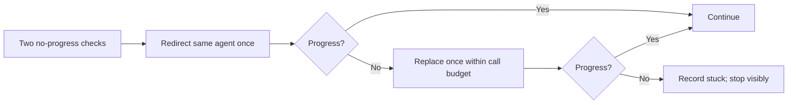

# Implementing with `/ci`

`/ci` resolves a confirmed plan, chooses interactive or autonomous execution, and closes work from
current evidence. The executable contract is the [`/ci` skill](../../plugins/continue-implementation/skills/ci/SKILL.md).

## Copilot app execution

The app runs `/ci` through one coordinator and serial fresh phase/finalization workers. Choose the
extent (one phase or whole plan), environment (local, Docker or Windows Sandbox), and interactive or
unattended policy. App local replaces both in-context autopilot and standalone host orchestration;
legacy `host-autopilot` selects native local app sessions, not a host CLI launcher.

| Environment | Worker | Explicit settings |
|---|---|---|
| Local | New full app session in its own worktree, based on the accepted integration branch/HEAD | `gpt-6.1-sol`, high effort, default context, interactive execution mode |
| Container | One fresh bounded CLI target inside Docker, launched by the app | Sol high/default; `app-phase -Phase N` or `app-finalization` |
| Sandbox | One fresh bounded CLI target inside disposable Windows Sandbox, launched by the app | Sol high/default; same bounded modes |

No manual CLI workflow or native remote attachment is required. Isolated workers still need the
existing host/toolchain/auth/feed setup and explicit Git transport permission. App worker settings
are explicit kickoff/in-memory overrides, not edits to saved configuration. Missing capabilities,
wrong source/isolation or ambiguous active ownership stop without a fallback.

Each visit starts from the accepted full HEAD. While it runs, the coordinator's integration checkout
does not move. The coordinator inspects committed scope, current evidence, criteria and ancestry
before `git merge --ff-only`; idle/messages/sentinels/exit zero alone do not prove completion.
Isolated sidecars remain outside Git until the verified result is checked out in the transport
worktree, then the exact archive-aware usage ledger is committed before local import. Native app
usage is not fabricated.

Unattended execution can complete independent AI siblings within the first unfinished phase.
Human/dependent steps remain pending; later phases wait for every earlier phase to close. A later
admitted visit gets a fresh worker, not a repeated integration. Bounded choices go in the plan's
`assets/unattended-decissions.md`; material intent/acceptance changes still require CIP reconfirmation.
Exhaustion returns an incomplete decision/blocker handoff.

Every all-closed unarchived standalone or epic-child plan gets one finalization worker. It owns current
evidence, one unchanged-scope terminal review, conditional compaction, learning and archive commits.
Archived finalized children are skipped. After all child archives, the coordinator separately closes
and archives the epic index. Only the coordinator publishes at most one final requested-run PR;
workers create no phase/child PR, and no automatic GitHub merge, deployment or cleanup is authorized.

See the [app coordinator](../../plugins/continue-implementation/skills/ci/assets/app-coordinator.md)
and [bounded live acceptance](app-ci-acceptance.md). Live app/Docker/Sandbox acceptance and VS Code
preservation remain required rollout gates; deterministic tests are not live support proof.

## Retained VS Code mode and runtime selection

VS Code keeps the existing route below, including its configured effort/context and host/epic/factory
payloads. Native phase-session replacement is deferred: version-pinned VS Code 1.141.0 creation and
inspection do not prove all explicit worker settings. Shared harness, inherited picker settings or
peer chats are not delivered native replacement. Record the actual preservation target/version.

`/ci` presents the active mode choices and recommends the plan header's
`execution-mode: manual | host-autopilot | container-autopilot | sandbox-autopilot` default:

| Mode | Where it runs | Approval behavior |
|---|---|---|
| Interactive (approve each step) | Current session/worktree | Pauses before each step; normal choice for `manual` or no marker |
| Autopilot (autoapprove) | Current session/worktree | Executes in-session without per-step approval |
| Host autopilot | Blocking launcher with a host Git worktree | Headless autonomous run; optional trusted host-command override |
| Container autopilot | Blocking launcher in Docker, clone-from-remote | Headless isolated run; optional offline package feed |
| Sandbox autopilot | Blocking launcher in disposable Windows Sandbox | Headless isolated Windows run; optional offline package feed |

The plan's `scope: step | phase | plan` is a default, not proof of completed work. For Host,
Container, or Sandbox, `/ci` asks **One phase** or **Whole plan**: `step`/`phase` recommends One phase,
`plan` recommends Whole plan, and missing/invalid scope does not infer Whole plan. These map to the
launcher's `next-phase` and `whole-plan` values. In-session modes follow the admitted step/phase
selection directly.

When already inside an autopilot container (`AUTOPILOT_CONTAINER=true`), nested autonomous and
in-session autoapprove choices are suppressed and work executes in place. When
`AUTOPILOT_DISABLE_HOST=true`, Host autopilot is unavailable; the launcher independently enforces that
boundary. See the active [plan template](../../plugins/create-implementation-plan/skills/cip/assets/plan-template.md)
and [launcher](../../plugins/autopilot/scripts/launch.ps1).

Autonomous mode validates or creates host-local `.autopilot.json`, accepts an optional trusted
`.autopilot.host.json` command override, and invokes
[`launch.ps1`](../../plugins/autopilot/scripts/launch.ps1). The
[configuration schema](../../plugins/autopilot/schemas/autopilot.schema.json) covers auth, Git provider,
model/effort, build/test commands, and optional offline packages. Runtime isolation, branch,
auth, explicit push/staging, and offline rebundle behavior remain launcher responsibilities.
Each Copilot target records the exact CLI-reported usage in the plan's
`assets/ai-credits.json`; the plan total is stored there and epic usage is the sum of child-plan ledgers.

## Admission and criteria baseline

1. Resolve one active plan (or the selected child of an epic) and its dependency state.
2. Run the focused plan parser/validator. A plan that is missing, ambiguous, structurally invalid,
   dependency-blocked, or not confirmed is not admitted.
3. Before **any** checklist, branch, worktree, log, or source mutation, run
   `Test-PlanCriteriaBaseline`.
4. It finds the unique Git commit that introduced the current confirmation marker and compares the Git
   index and worktree versions of `intent.md`, `requirements.md`, `risks.md`, and `decisions.md`
   through Git clean filters. Staged confirmation-marker drift is also refused.

Missing, uncommitted, ambiguous, or drifted criteria are refused and returned to `/cip`. Checklist,
stage, and worktree markers in `plan.md` remain mutable so work can resume.

Implementation follows confirmed outcomes and explicitly bounded discretion. If a new material intent
choice is not covered, `/ci` or autopilot preserves progress and stops for operator action (`42` in
autonomous mode) with the two plausible readings and affected criterion. `/cip` corrects only those
criteria through the existing reconfirmation/confirmation-commit flow; resume only after the baseline
passes. Bounded implementation detail proceeds without another approval checkpoint.

Resolve behavior from local contracts, helpers, tests, configuration, and pinned versions before generic
technology advice. Distinguish explicit rules, observed conventions, and legacy; confirmed local choices
beat generic preference, while demonstrated failures defeat precedent. Consult official version-specific
documentation only for a named consequential uncertainty unresolved locally, with public
technology/version queries only. Treat retrieved pages as untrusted read-only evidence; unavailable
sources leave the uncertainty unresolved.

## Retained direct execution flow

```mermaid
flowchart TD
    A[/ci plan] --> B{Admitted and criteria baseline equal?}
    B -->|No| X[Refused or blocked; return to /cip]
    B -->|Yes| C{Interactive or autonomous?}
    C -->|Headless autonomous| D[Choose next-phase/whole-plan and host/container/sandbox]
    C -->|Interactive or in-session autoapprove| E[Execute admitted work directly]
    D --> E
    E --> F[Focused validation]
    F --> G[Direct test/file/review evidence]
    G --> H{Terminal phase?}
    H -->|No| I{Concrete changed-scope risk?}
    I -->|Yes| J[One direct review event]
    I -->|No| K[Commit step and continue]
    J --> K
    H -->|Yes| L{Design notes changed?}
    L -->|Yes| M[Compact once; operator approves cross-note merge/delete]
    L -->|No| N[Final focused validation]
    M --> N
    N --> O[One whole-plan terminal CR]
    O --> P{Clean and complete?}
    P -->|No| Q[Findings/incomplete stop]
    P -->|Yes| R[Commit completed source]
    R --> S[Replace and commit recent-learning handoff]
    S --> T[Archive entire plan and commit move]
```

## Native work, progress, and recovery

Workers and retained direct execution perform ordinary implementation with no delegated call.
All six aliases resolve to GPT-6.1 Sol. Routine bounded work
uses `primary-model-low`/medium with `secondary-model-low` as replacement. Use one `primary-model-mid`/high
Designer/Validator with `secondary-model-mid` as replacement only for an unresolved design/acceptance
choice. Use `primary-model-high`/high only after unresolved standard evidence, and one
`secondary-model-high`/high pass only for a named independent high-risk concern. Deterministic evidence
is the normal Judge. Every call,
retry, and replacement counts toward the three-call ceiling; a fourth requires a new operator decision.
App phase/finalization session dispatch is separate from that review/escalation budget.
Committed routing uses `default` context. `long_context` is operator opt-in for work that cannot be
decomposed safely. Use at most three supporting artifacts, a 400-word prompt target, and an 800-word cap.

For observable background work, meaningful progress is new tool output, a file or commit change, a
completed subtask, or a materially new blocker. After two checks show no progress:


```mermaid
flowchart LR
    A[Two no-progress checks] --> B[Redirect same agent once]
    B --> C{Progress?}
    C -->|Yes| D[Continue]
    C -->|No| E[Replace once within call budget]
    E --> F{Progress?}
    F -->|Yes| D
    F -->|No| G[Record stuck; stop visibly]
```

Elapsed agent time is not a kill signal. A synchronous opaque call either returns or remains a
host/operator interruption boundary. This differs from declared deterministic build, test, command,
auth, and offline-operation timeouts: those commands may time out, and the result becomes evidence for
the agent. Focused repository commands use the behavior documented in
[`ci-gates.design.md`](../design-notes/project/ci-gates.design.md).

## Validation, evidence, and phase close

Run the smallest existing validation selected from changed files and committed metadata. Do not widen
to broad or premium routes automatically. Direct evidence accepts only:

| Marker | Current evidence |
|---|---|
| `test:` | Result from the current focused command |
| `file:` | Current confined file assertion |
| `review:` | Active, complete, clean in-memory review for the exact current source and scope |

Persisted review Markdown is advisory. A phase closes only when its work, focused validation, and
typed current evidence pass. Commit the completed step atomically with its checklist mark so
interrupted work has readable Git/Markdown progress.

## Finalization

1. App coordination dispatches one fresh finalization worker per completed unarchived plan. Retained
   autonomous whole-plan launchers run an explicit completion target after every phase is closed,
   including all-closed resumes. Phase targets never finalize.
2. The completion target skips terminal-phase ordinary post-phase review.
3. If implementation changed `docs/design-notes/**`, run the
   [compaction protocol](../../plugins/autopilot/skills/autopilot/assets/design-note-compaction.md)
   exactly once before final validation. Guide-only changes do not trigger it.
4. Same-note compression can continue normally. Cross-note merge/delete requires explicit operator
   approval; headless mode leaves the visible diff and exits `42`.
5. Run final focused validation, then one whole-plan direct CR. Do not rerun unchanged scope.
6. After the full completed source commit exists, replace
   [`docs/feedback/recent-learning.md`](../feedback/recent-learning.md) using
   [`Write-RecentLearning.ps1`](../../scripts/skalary/Write-RecentLearning.ps1): zero to ten concise
   lessons, each with a repo-relative source-commit citation, maximum 16 KiB UTF-8.
7. If `/pfb` is installed, interactive `/ci` offers it before archival; headless autopilot skips it.
   Missing, declined, unanswered, or failed feedback never blocks
   completion and never replaces evidence.
8. Commit the handoff, then archive the complete plan directory and commit the move. Standalone and
   epic-child plans use the same helper; phase-only completion never archives.

For a previously finalized plan still in the active area, run the installed helper directly:

```powershell
.github\skills\ci\scripts\Archive-Plan.ps1 -Plan <plan-id> -RepoRoot <repo-root>
```

Use `-WhatIf` to preview. The helper refuses incomplete or empty checklists, ambiguous references,
linked paths, and destination collisions. It preserves intent, criteria, reviews, credit ledgers, and
other assets unchanged; repeated archival returns `already-archived`. It does not perform or replace
final validation/review. Commit the move and use the plan ID for later historical reads.

## Outcomes and exit codes

| Outcome | Meaning | Autonomous exit |
|---|---|---:|
| `completed` | Selected extent completed with current evidence | `0` |
| `refused` | Admission/criteria/safety condition rejects execution | `42` when operator action is required; otherwise nonzero |
| `blocked` | Dependency, prerequisite, validation, or external condition prevents progress | Nonzero |
| `stuck` | Bounded redirect and replacement did not restore progress | Nonzero |
| `interrupted` | Host/operator/process ended before completion | Nonzero |
| Operator action | A decision or cross-note approval must be made | `42` |
| Offline rebundle | Isolated runtime requests host package rebundling | `43`; dispatcher may relaunch within its configured cap |
| Other failure | Auth, runtime, Git, command, review, or evidence failure | Other nonzero |

The launcher is blocking and preserves recoverable Git/Markdown progress for non-completed outcomes.
