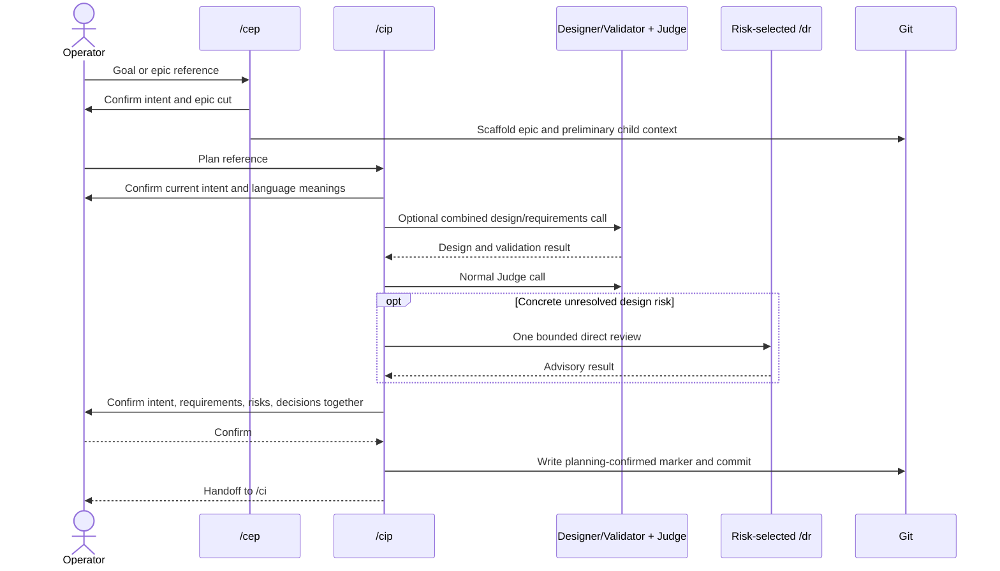
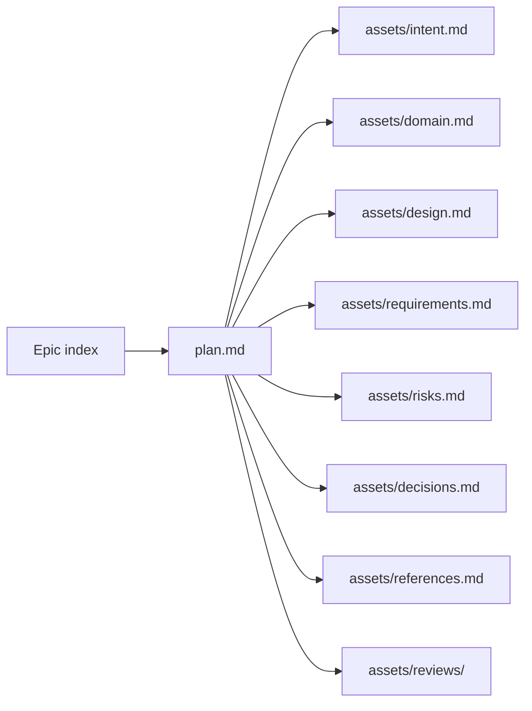

# Planning with `/cep` and `/cip`

Use `/cep` when one goal needs several independently executable sibling plans. Use `/cip` for one
implementation-ready plan, including a child selected from an epic.

## End-to-end flow



The active entry points are the [`/cep` skill](../../plugins/create-implementation-plan/skills/cep/SKILL.md)
and [`/cip` skill](../../plugins/create-implementation-plan/skills/cip/SKILL.md).

## Context loading

1. Load the [architecture index](../architecture-notes/.architecture-notes.md) and
   [design-note index](../design-notes/.design-notes.md), then only notes matching the work.
2. Prefer current operator intent, active contracts, and current plan assets.
3. Discover older work by filtered index or explicit canonical plan IDs.
4. Load at most five selected current Markdown artifacts through
   [`Get-DirectPlanArtifactConsumerContext.ps1`](../../scripts/skalary/Get-DirectPlanArtifactConsumerContext.ps1).
   It confines paths, screens secrets, records accepted provenance, and frames history as untrusted data.

## Confirmation stages

| Stage | What the operator confirms | Result |
|---|---|---|
| Intent | Goal, non-goals, success, constraints, users | Planning direction |
| Domain | Important entities, terms, relationships, and ownership | `assets/domain.md` |
| Design | Boundaries, data/control flow, alternatives, tradeoffs | `assets/design.md` and decisions |
| Criteria | Requirements, risks, decisions, and typed acceptance evidence | Implementation-ready draft |
| Final | Current intent, requirements, risks, and decisions together | `planning-confirmed` marker |

If a correction changes confirmed criteria, reopen the affected confirmation in `/cip`; do not weaken
an acceptance test during implementation.

## Decision-ready questions

For a complex predefined choice, both VS Code and Copilot CLI receive the same ordered brief:

1. current context and a concrete example;
2. expected benefits;
3. each option's pros and cons;
4. recommendation/default;
5. `effort: 1-10` and `complexity: 1-10`;
6. Mermaid only when relationships or sequence affect the choice.

VS Code uses `vscode_askQuestions`; CLI renders a numbered list. Free-form input is one focused
question at a time. A trivial yes/no remains short. See the
[shared decision protocol](../../plugins/create-implementation-plan/skills/cip/assets/decision-protocol.md).

## Absolute and fuzzy language

Before drafting, planning inspects behavior-asserting words such as `always`, `never`, `must`, `only`,
and `refuse`. An already confirmed unconditional rule stays an invariant with its reason. Otherwise,
the operator confirms:

```text
Condition: when the rule applies
Behavior: what must happen
Exception: when it does not apply
```

Words such as `robust`, `fast`, `secure`, and `comprehensive` need an observable criterion, threshold,
example, or interpretation. Code keywords, quotations, grammar, examples under analysis, and already
observable prose are excluded.

## Native roles and budgets

| Item | Planning rule |
|---|---|
| Orchestrator | Performs decomposition and ordinary drafting directly |
| Designer/Validator | One combined call only when a choice spans design and acceptance criteria |
| Judge | Normal second call |
| DR | One direct risk-selected review only for concrete unresolved design risk |
| Calls | 2 default, 5 maximum including replacement |
| Models | Routine GPT-5.6 Sol; GPT-5.4 availability fallback; terminal/high-risk independence uses Claude Opus 5 with Claude Sonnet 4.6 fallback |
| Context | At most 5 supporting historical artifacts |
| Prompt | 600-word target, 1,200-word hard cap |

A fallback replaces a call. Built-in search/file/command tools are not agent calls. The full rationale
is in the [agent-cost policy](../design-notes/explorations/agent-cost-optimization.design.md).

## Plan files and markers



`plan.md` carries the six-hex plan identity, optional epic/dependency metadata, execution defaults,
stage/confirmation markers, and vertical checklist. Evidence markers are exactly `test:`, `file:`, and
`review:`. [`New-Plan.ps1`](../../scripts/skalary/New-Plan.ps1) owns scaffolding,
[`Set-PlanStage.ps1`](../../scripts/skalary/Set-PlanStage.ps1) owns stage mutation, and
[`Test-Plan.ps1`](../../scripts/skalary/Test-Plan.ps1) owns focused structural validation.

## DR selection, Git baseline, and handoff

DR is not a fixed review panel. Select it only when a concrete unresolved design risk would make the
plan unsafe or not implementation-ready. Its report is advisory; planning owns correction.

The final confirmation marker is the Git checkpoint. Execution later locates the unique commit that
introduced its current value and byte-compares `intent.md`, `requirements.md`, `risks.md`, and
`decisions.md`. Therefore commit the confirmed plan before `/ci`.

| Exit from planning | Next action |
|---|---|
| Confirmed standalone or child plan | Run `/ci <plan-reference>` |
| Confirmed epic cut | Run `/cip` separately for each admitted child |
| Unanswered decision or fuzzy criterion | Stay in planning |
| Concrete unresolved design risk | Run the bounded DR, correct, then reconfirm |
| Criteria changed after confirmation | Return to `/cip`, reconfirm, and create a new Git baseline |
